## For University of South Carolina
## Feb. 3, 2020, Columbia, SC

    
   
  

>

### Rob Wells, Ph.D., University of Arkansas, Fayetteville, AR    

   

>

### **Today's Presentation**

# <http://bit.do/SCdata>

 
--- 

**This 1 hour hands-on session will show journalists how to build basic data visualizations and maps using FBI crime data.** 
 
 
Learning Outcome: Journalists will learn to build basic data visualizations and maps for their own cities or regions. We'll learn the steps to put this work on a basic map and an interactive chart. We will use Tableau Public.

   

>  

## Download Tableau Public

> [Tableau Download: "CNTL" + click for a New Tab](https://public.tableau.com/en-us/s/){target="_blank"}

We'll configure this in the second part of the presentation, but you can start the download now. It is a 400 mb download that will take about 1.5 GB on your hard drive. 

Also, you will need to create a Tableau Public account. 

 

>

## Storytelling with FBI Crime Data  

This section will analyze the storytelling possibilities with the FBI Uniform Crime Reporting Data.   

Gather the FBI Uniform Crime Reporting, Data For All South Carolina Cities, All Crimes

> [FBI Crime Overview: "CNTL" + click for a New Tab](https://ucr.fbi.gov/crime-in-the-u.s/2018/crime-in-the-u.s.-2018){target="_blank"}

#### Description of Dataset   

FBI Crime Data for South Carolina
Data Dictionary: Uniform Crime Reporting, Read General Resources
https://ucr.fbi.gov/crime-in-the-u.s/2018/crime-in-the-u.s.-2018

https://ucr.fbi.gov/
– A Word About UCR Data 
– UCR Statistics: Their Proper Use (pdf)

> [Details About The Data: "CNTL" + click for a New Tab](https://ucr.fbi.gov/crime-in-the-u.s/2018/crime-in-the-u.s.-2018/tables/table-8/table-8-data-declaration){target="_blank"}

   
     

#### Data limitations

> This data series lags significantly. We are working with 2018 data, the most recent available. 

> Other issues:
> Voluntary Guidelines   
Not All Locales Report     
Not all Locales Are the Same – St. Louis is City/County    
Data users should not rank locales because there are many factors that cause the nature and type of crime to vary from place to place    
Rankings ignore the uniqueness of each locale     
Since crime is a sociological phenomenon influenced by a variety of factors, the FBI discourages ranking the agencies and using the data as a measurement of law enforcement effectiveness    

> Population density and degree of urbanization. 
Variations in composition of the population, particularly youth concentration. 
Stability of the population with respect to residents’ mobility, commuting patterns, and transient factors. 
Economic conditions, including median income, poverty level, and job availability. 

> But it is still the best you can get and <b>you can't beat the price<b>.  
 
 
   

>

## Step 1: Retrieve the Data 
 
  

Table 8: Offenses Known to Law Enforcement by City, 2018
> [Table 8 - FBI Crime Data](https://ucr.fbi.gov/crime-in-the-u.s/2018/crime-in-the-u.s.-2018/tables/table-8/table-8-state-cuts/south-carolina.xls){target="_blank"}

>
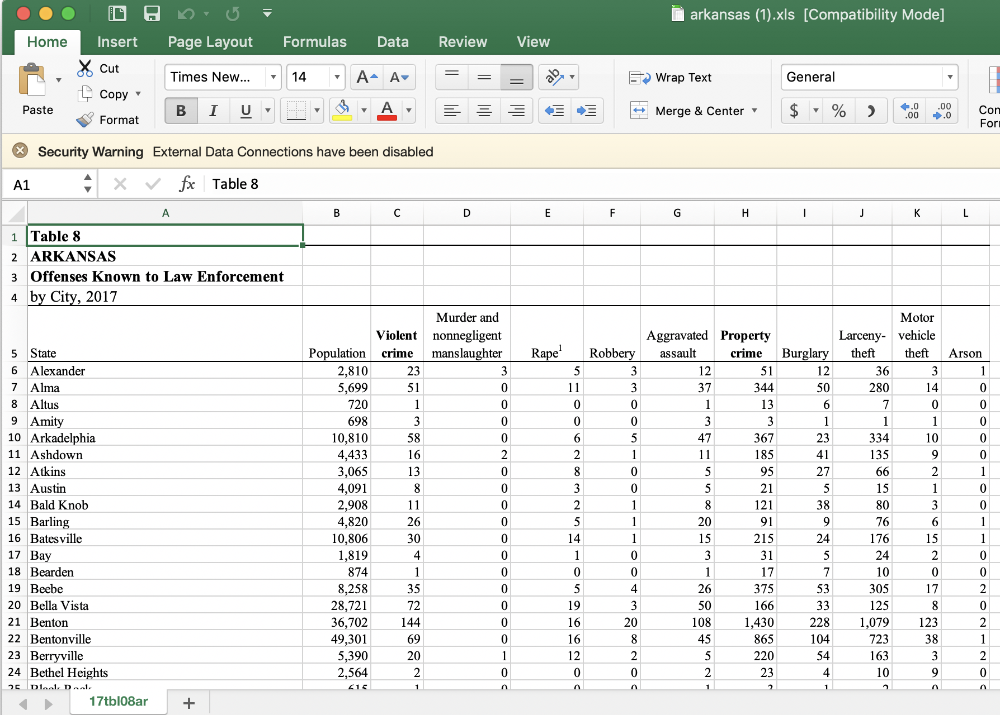
 
 

* Let's see what we have.   
    + One table of violent and property crime data.   
    + 186 cities and towns.    
 
  
Walk through the tables:

**Table 8:** Violent Crime totals: Murder, Rape, Robbery, Aggravated Assault

Property Crime totals: Burglary, Larceny-theft, Motor vehicle theft, Arson.  
   
  

>

#### Data limitations - Weirdness 

> You may see a notation (1) in Rape. In 2013, the term “forcible” was removed from the offense name, and the definition was changed FBI discontinuing reporting of rape data using the UCR legacy definition beginning in 2017.

> [Details are in Data Declaration: "CNTL" + click for a New Tab](https://ucr.fbi.gov/crime-in-the-u.s/2018/crime-in-the-u.s.-2018/tables/table-8/table-8-data-declaration){target="_blank"}

>

#### Data Cleaning     

> The Google sheet, the FBI18 tab, has been cleaned and modified so it will play well with Tableau. Basically, the FBI spreadsheet was cleaned to remove the first four rows so Tableau will recognize the column headings ("Locality, Population, Violent Crime, etc"). 

> Here is a 10-minute video on how to do basic data cleaning, using another data set, but the principles apply. You can watch it later and amaze your friends:

> [Video on Excel Data Cleaning: "CNTL" + click for a New Tab](https://www.youtube.com/watch?v=5bS-GKvFzBk){target="_blank"}

> And here is the end result in a Google Sheet. Add this sheet to your Google Drive or download it as a spreadsheet on your computer.  

> [Cleaned Data: "CNTL" + click for a New Tab](https://drive.google.com/file/d/1BDAVI88EWeghnAeBQn1aZuxtEaoX2fzW/view?usp=sharing){target="_blank"}

 
 
   

## Step 2: Basic Interactive Chart

For this part, we will use Tableau Public to produce charts and a map. Download the app if you haven't already  

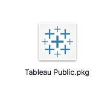  

> https://public.tableau.com/en-us/s/  

> You will need to create a Tableau Public account.    

#### Launch the App      

Tableau accepts many data sources. Under "To a Server" there's an option for Google Sheets. It will ask for access to your Google account and say ok.

Option #2:
Download the FBI data to your computer as an Excel file, and then load it into Tableau.   

  > [Cleaned Data: "CNTL" + click for a New Tab](https://drive.google.com/file/d/1BDAVI88EWeghnAeBQn1aZuxtEaoX2fzW/view?usp=sharing){target="_blank"}

**With the Google Sheets link, select **FBI18** and drag it to the pane that says "Drag sheets here." **    
     

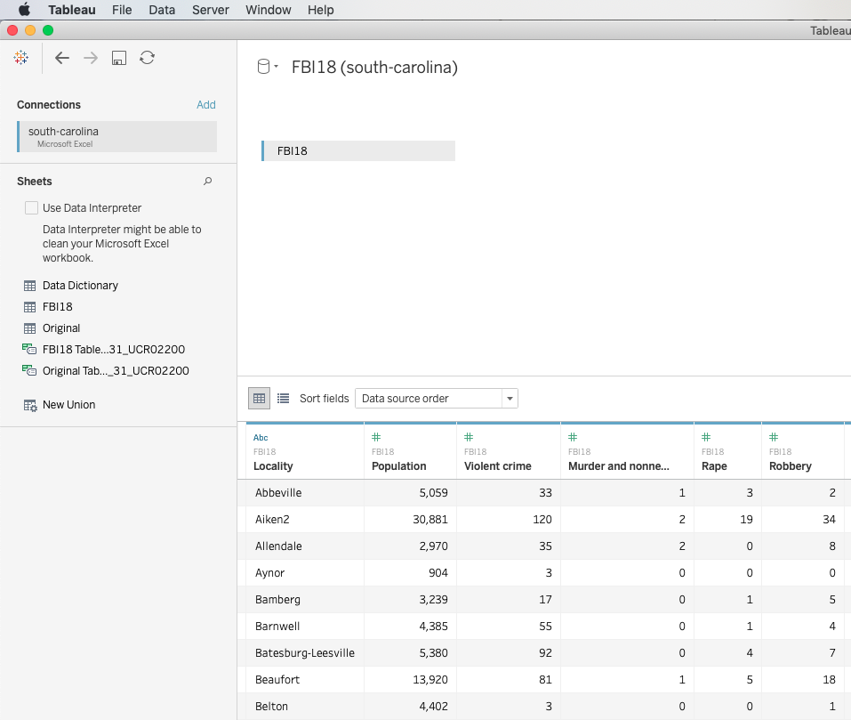
 
   

> Clean the data with the "Data Interpreter." Click the box is right above the sheet listing.  

> **Now, look at the data.**  

> "Locality" should be the only things in text, designated in a blue "ABC." That's a dimension. The rest should be with a green # sign. Those are measures. The difference between dimensions (ABC) and measures (#) is crucial in Tableau.   

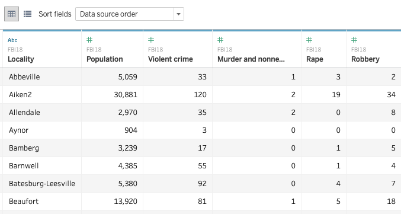
 
    

> We're ready. Click on "Sheet 1" in lower lefthand corner.    

 
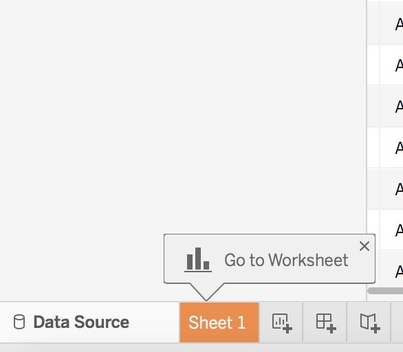 

 
   

> **Welcome to a Tableau Worksheet**   

 

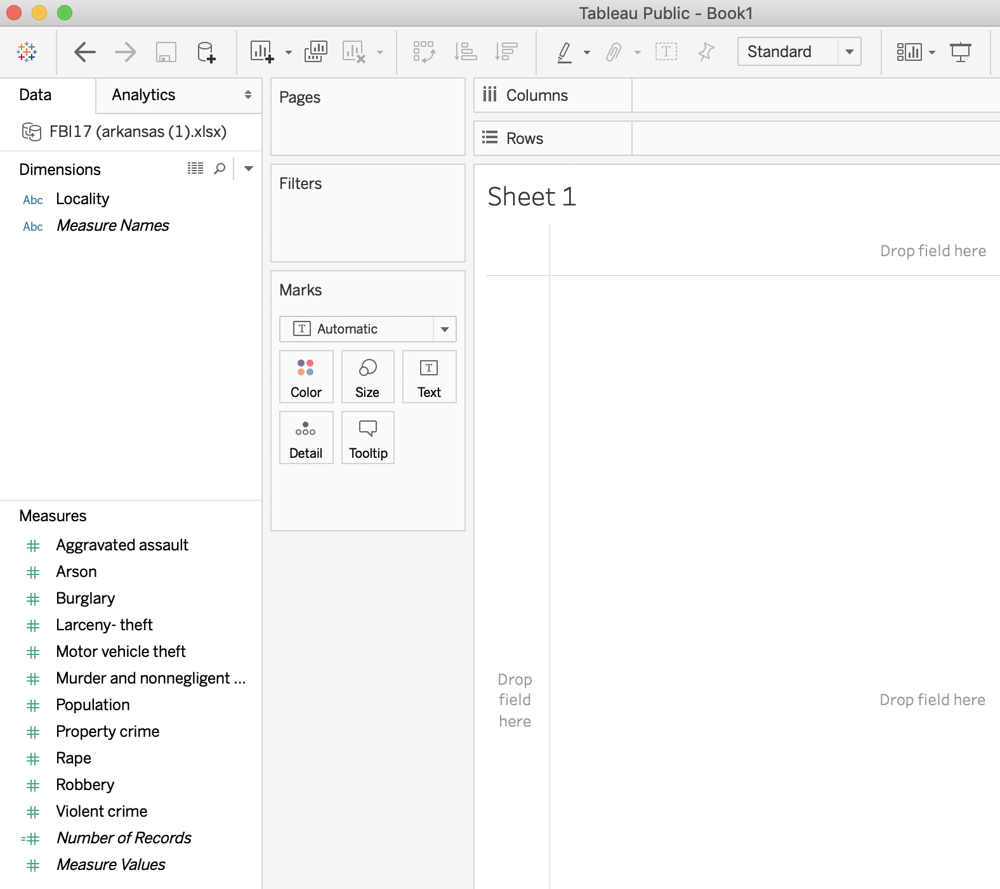
 
   

> 1) Drag the "Locality"" dimension to Rows   
  2) Drag the "Violent Crime" measure to Columns
  3) Click Sort Descending Button in Toolbar  (below "Dashboard" on menu)

#### You should have an image like this:   
 

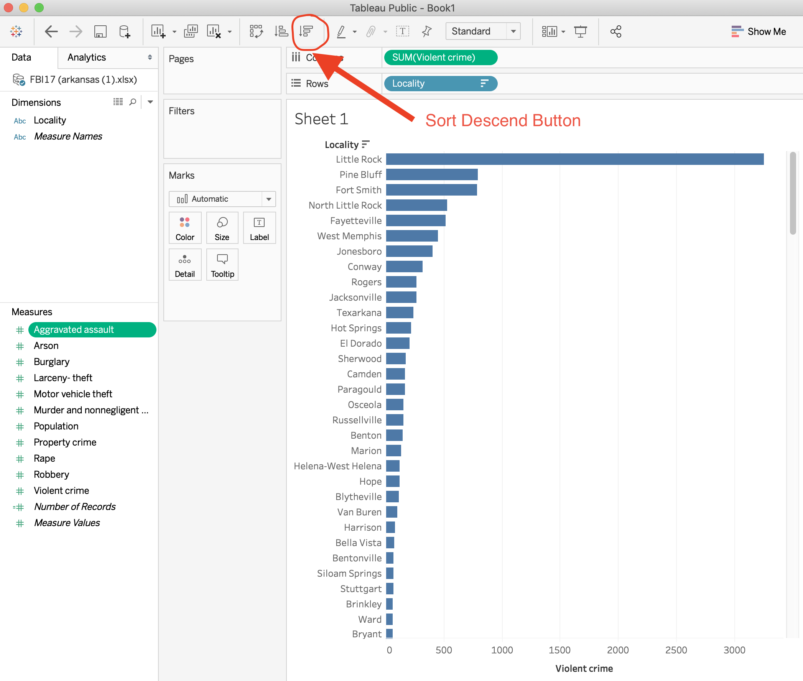
 
   
* This is your basic graph of violent crime in South Carolina in 2018.  

> Pro Tip: **Duplicate and Iterate.** Duplicate the Sheet 1: Left clicking on Sheet 1 tab. Select duplicate. More on Duplicate and Iterate later.    

> Filter to South Carolina cities   

    + To filter, drag Population (in Measures, left column) to Filters
    + Select All Values, Minimum Value at 22,578
    + The 22,578 will filter out the 20 largest South Carolina cities.
  

   
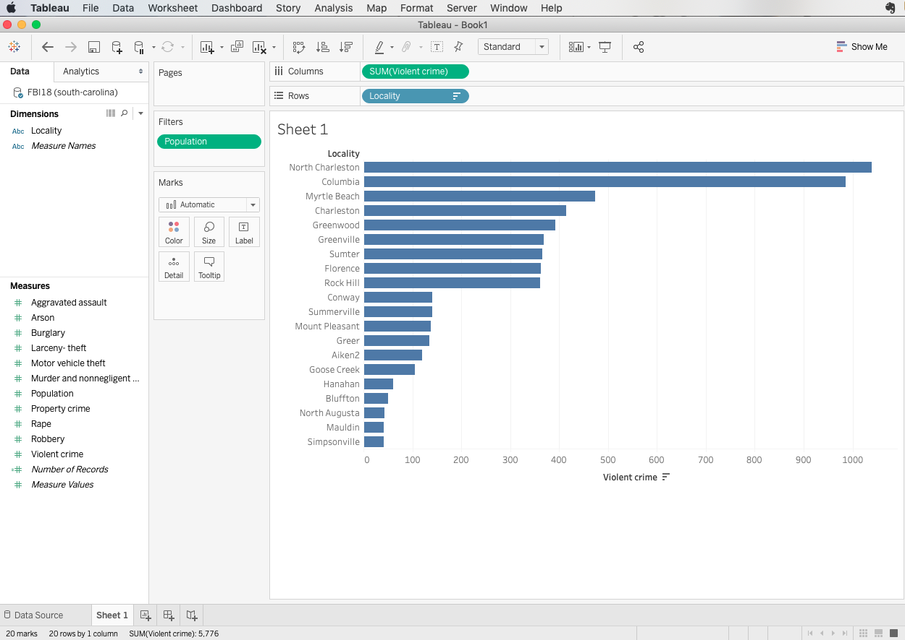
 
   
* Create a Filter Slider
    + In The Filter Box, Select Population, click on down arrow on right
    + Click "Show Filter"
    + Filter with Slider appears in Right. 
    + Adjust filter as you wish
   

>

#### Per capita crime calculation
> * Crime per 1,000 residents

>   1) Click Sheet 2
    2) Click on "Violent Crime" - select down arrow, see menu, select Create | Calculated Field
    3) You will create this calculation:  [Violent Crime] / [Population] *1000
    4) Dialog Box Displays [Violent Crime]
    5) Add a division operator: [Violent Crime] / 
    6) Drag Population to complete the equation:  [Violent Crime] / [Population]
    7) Type *1000
    8) Rename it Violent Per 1000, click OK
    
   
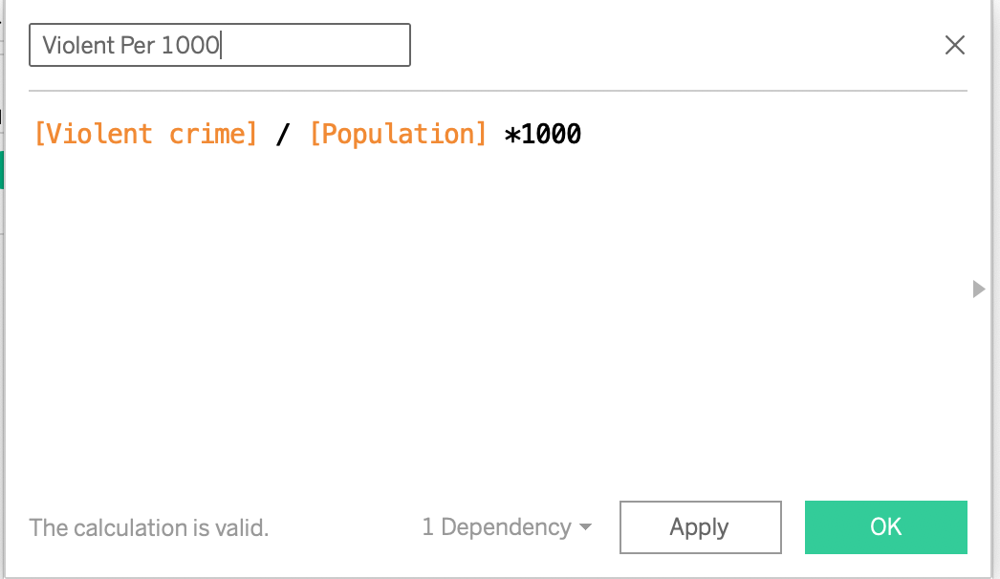    

> 1) Drag the "Locality"" dimension to Rows   
  2) Drag the "Violent Per 1000" measure to Columns
  3) Click Sort Descending Button in Toolbar  (below "Dashboard" on menu)
  4) Drag Violent Per 1000 to Color in the Marks Bar
  5) Click Color, Edit Colors, Select Palette down arrow, select red-green diverging
  6) Select Reversed, Click OK
  7) Drag Violent Per 1000 to Label
  8) Make a headline
      
      + Double Click on the heading, "Sheet 2" and type in a headline. 
      + Estill Has Highest Per Capita Crime Rate In SC
      + Violent Crime Per 1,000. Source: FBI Uniform Crime Report Data, 2018.
      + https://ucr.fbi.gov/crime-in-the-u.s/2018/crime-in-the-u.s.-2018/tables/table-8/table-8-state-cuts/south-carolina.xls
      + Use the formatting tools to adjust fonts and center. 

> Finished chart should look like this:

   
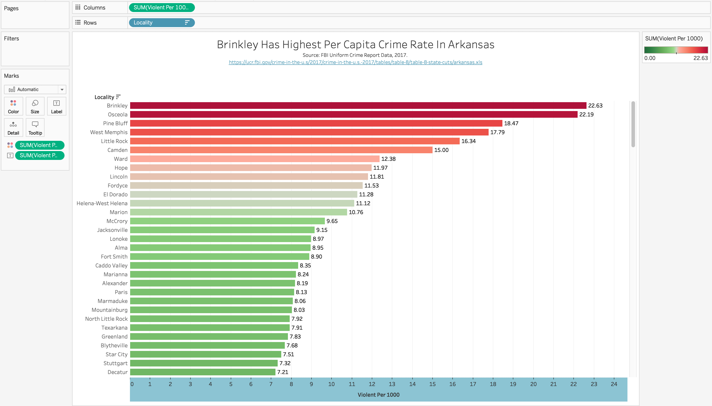   
    
     
    + Format the numbers and legend. Look at the Marks card. Find the green pill representing the label "Sum(Violent Per 1000)." Click the down arrow in this label. Click Format. 
    
    + If you had a percentage: The Format pane appears to the left. Under "Default," select "Numbers." Then select "Number - Custom." Select two decimal places and put a % sign in the suffix.
    
    + Format the Y axis legend. Left click on the Y axis to see menu. Select "Format." See the formatting pane on left: select "Axis." On "Scale," select "Numbers." Then select "Number - Custom." Select no decimals and put a % sign in the suffix.

    + Drag right border out to expand the chart. Mouse over right edge to find the graphic.
    
    + Rename the tab "Sheet 1" to "Arkansas Crime"

   

>   

## Step 3: Basic Map

> We'll use the same data for a map.  
> First, we have to apply a geographic role to the Dimension "Locality." This associates the city with geocoding so it can be applied to a map.   

* Geocode Data
    + Click on "Locality" down arrow  
    + Select "Geographic Role" and then Select "City" 
        - this converts the text of Metro Area into data for mapping.

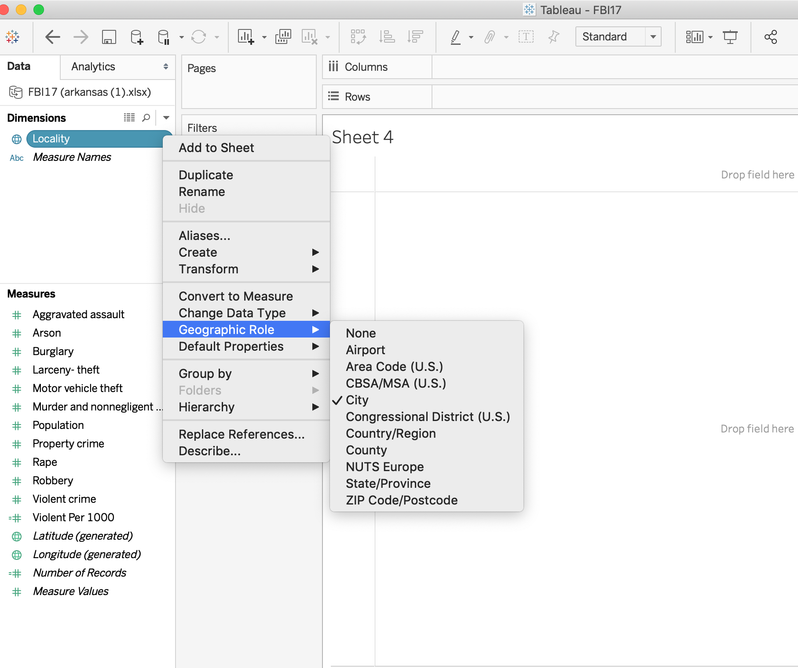

Notice in Measures that Latitude and Longitude measures are now created. 

>

## Follow These Steps:   

> + Click on "new worksheet" tab at lower left. It creates a new Sheet.    
  + Drag Longitude to Columns, Latitude to Rows    
  + Drag "Locality" to the sheet. An South Carolina map appears with blue dots.  
  
   

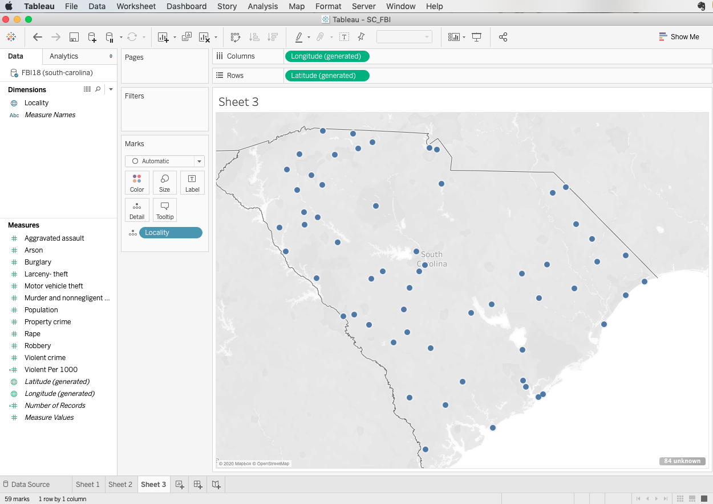

>

#### Data Cleaning!    
>  + Note lower right hand corner: "84 unknown." To fix this, we need to tell Tableau these cities are in South Carolina
  + In top menu, select Map | Edit Locations
  + In state, select Fixed | South Carolina
  + FYI: Three others remain: Springdale, St. Stephen, Forest Acres. Long story on fixing those - involved editing latitude and longitude coordinates: Springdale: 33.960952, -81.109895    
  
    

>

#### Back to Map Building!   
> + Drag Violent per 1000 onto the map. Different sized dots appear
  + Drag Violent per 1000 onto Color. Edit colors to Red-Green Diverging. Reverse the scale
  + Click on size in Marks, adjust slider to enlarge the circles   
  
     

>

#### Headline          
>   + Double Click on the heading, "Sheet 2" and type in a headline. 
    + I typed "South Carolina Crime, 2018
    + Source: FBI Uniform Crime Report Data, 2018. 
    + https://ucr.fbi.gov/crime-in-the-u.s/2018/crime-in-the-u.s.-2018/tables/table-8/table-8-state-cuts/south-carolina.xls
    + Use the formatting tools to adjust fonts and center.  
  
>

#### Tweaking and Cleaning    

> + Remove Right Legend: Down arrow |Hide Card
  + Drag color legend to x-axis, drag up top border to resize

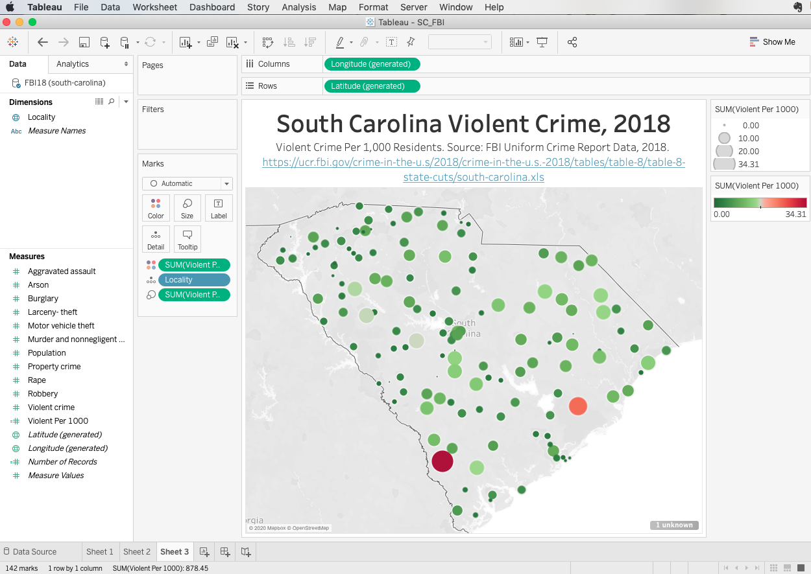
  
 
 
---
* If you are good with this tutorial, then create a chart and map for your local community. 
    Chart the following:
    + Details on violent crimes in your area
    + Details on property crimes in your area
    + Property crimes per capita in your area
    
For example:
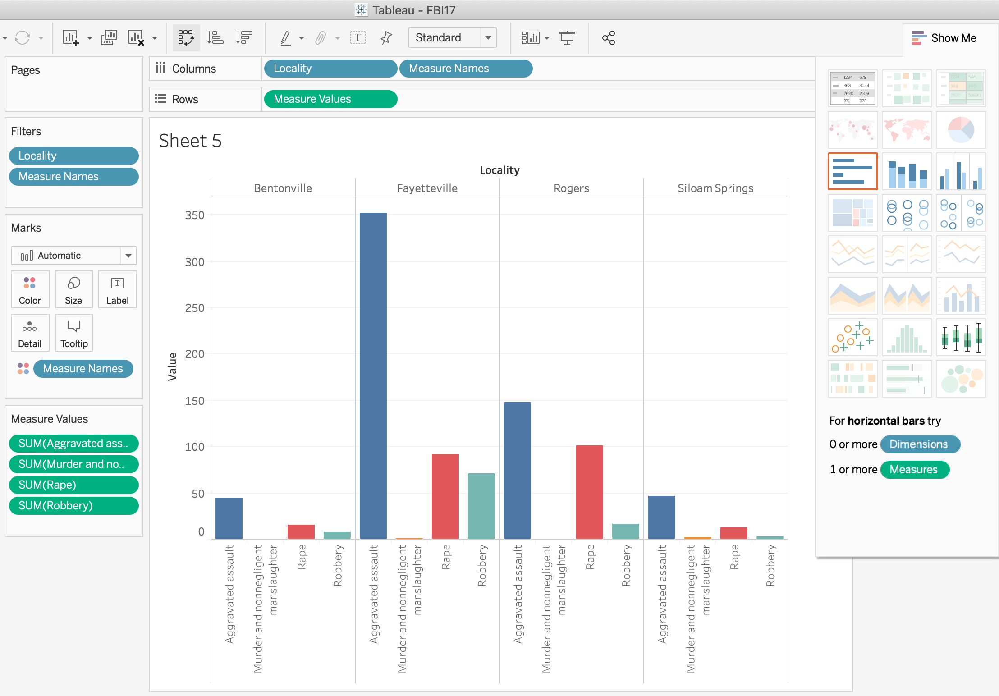

For example:
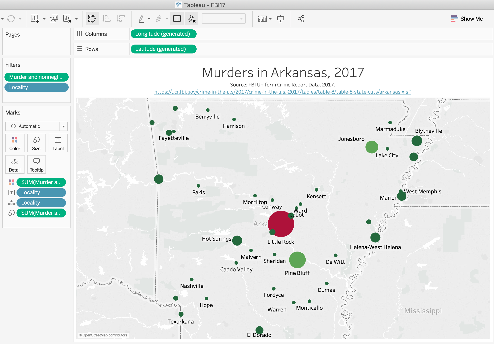

      
    

> [Use Tableau story for multiple perspectives. Here's an example of what you can do: "CNTL" + click for a New Tab](https://public.tableau.com/shared/THHKYTJC8?:display_count=yes&:origin=viz_share_link){target="_blank"}   

 
    

> **Story Function**  
> The story function allows you to compile all of these separate sheet into one visual, interactive narrative. 
> Click book icon in lower right to create a story.
> Add your various sheets to a story, creating one interactive graphic with multiple panels.

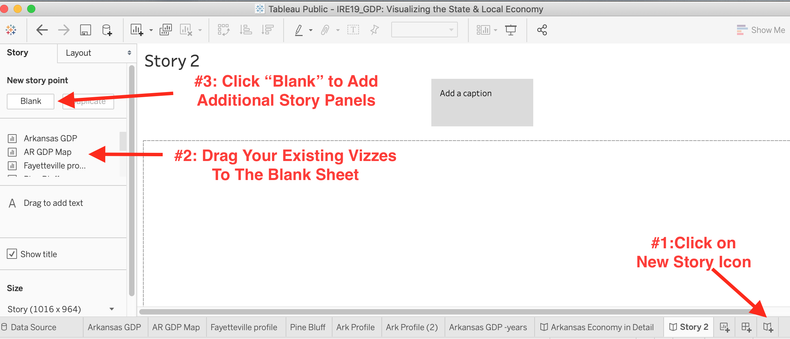

    
 

>  **Duplicate and Iterate.**    
  I built these multiple views by first formatting the first Arkansas sheet. Duplicate by left clicking on the sheet tab. Once copied, adjust the filter for your state or city. 
  You can zero in on specific items and build specific data visualizations for industries or cities.  
  Get the embed code from Tableau Public and add it to your blog or website.  
  
  
> Now, go experiment and figure out some other visualization!

> 

**Thank you.**  

>

###Follow up questions:   

- Rob Wells - rswells@uark.edu or @rwells1961  

   

 

**--30--**

