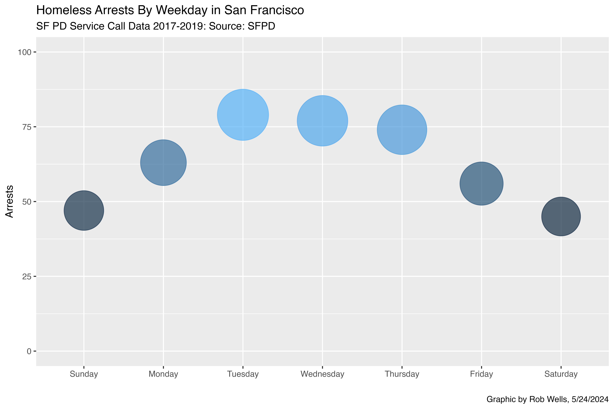

::: {style="text-align: center; color: #337DFF;"}
# Basic Visualization in R

# Workbook

```         
Rob Wells, Ph.D.
Philip Merrill College of Journalism
University of Maryland
robwells@umd.edu
LinkedIn: https://www.linkedin.com/in/rob-wells-7929329/ 
ver. 5/29/2024 
```

<br>

## Learning Objectives

-   Gain confidence using the tidyverse packages dplyr and ggplot2\
-   Sort, filter, group, summarize, join, and visualize\
-   Identify trends in your data.

<br>

#### Analysis of San Francisco Police Calls for Service Data

::: {style="text-align: center;"}

:::

##### Here is [the original dataset: 3,048,797 records](https://data.sfgov.org/Public-Safety/Police-Department-Calls-for-Service/hz9m-tj6z/data)

```         
311 logs calls on general non-emergency issues ranging from blocked sidewalks to graffiti to homeless concerns. Details: https://support.datasf.org/help/311-case-data-faq
```

**This tutorial uses a subset of this data**

```         
The Calls for Service were filtered as follows:  
CONTAINS homeless, 915, 919, 920: Downloaded 157,237 records 3/31/16 to 11/30/2019. 
This is 5.1% of all calls in the broader database.
File renamed to: SF_311_Jan29.xlsx   
```

<br>

## Part 1: Load Software, Interview Data

```{r message=FALSE, warning=FALSE}
#background on tidyverse: https://www.tidyverse.org/packages/
#load the lubridate, tidyverse and janitor libraries
library(lubridate)
```

**Load Data**

```{r}
SF <- rio::import("https://docs.google.com/spreadsheets/d/1-nkosLJKkfeLSl-UG82DDyiEw5-62kX2alS6ICG9iuk/edit#gid=552005485", sheet = "SF Police_Department_Calls_for_") 
```

**Interview the Data**

```{r}
#display the first six rows of SF using head
```

**Really Interview the Data** How big are you? Rows? Columns? List of
column names?

```{r}
#examine all of the SF data using glimpse
```

**Clean column names, Process dates**

```{r}
#This cleans column names
SF <- janitor::clean_names(SF)
#This processes dates for analysis
SF$call_date2 <- mdy(SF$call_date)
#This creates a new column for year
SF$year <- year(SF$call_date2)
```

**Sort by Date**

```         
We're using a weirdo command called a 'pipe' - %>% - that joins
lines of code. In the example below, the SF table is filtered in descending order and the results are dumped into a new file called SF1.
```

```{r}
#descending order
SF1 <- SF %>% 
arrange(desc(report_date))
#head(SF1)
```

**Create a Table: 311 Calls by Year**

```{r}
Years <- SF %>% 
  count(year) %>% 
  group_by(year) %>% 
  arrange(desc(year))
head(Years)
```

<br>

## Part 2: Basic ggplot

**Graph Years using ggplot**

```{r}
ggplot(data=Years) +
  geom_col(mapping=aes(x=year, y=n)) 

```

**That's ugly. Add some color: fill=n**

```{r}
ggplot(data=Years) +
  geom_col(mapping=aes(x=year, y=n, fill=n)) 

```

**Ditch the legend: theme(legend.position = "none")**

```{r}

ggplot(Years,aes(x = year, y = n,
             fill = n)) +
  geom_col(position = "dodge") + 
  theme(legend.position = "none")

```

**Add Headlines, Annotations and Credits: labs(title =**

```{r}

ggplot(Years,aes(x = year, y = n,
             fill = n)) +
  geom_col(position = "dodge") + 
  theme(legend.position = "none") +
#This is your title sequence
  labs(title = "311 Calls for Service By Day, San Francisco",
       subtitle = "SF PD Service Call Data, 2016-2019",
       caption = "Graphic by Rob Wells, 2-12-2022",
       y="Number of Calls",
       x="Year")
```

**Filter a dataset, build a chart in one code block**

```{r}
#Copy section of code from above...
# SF %>% 
#    count(year) %>% 
#    group_by(year) %>% 
#Sandwich it onto a simple ggplot that you created in the prior code chunk
  
```

<br>

### Your Turn

**1) Which Day Had the Most 311 Calls?** Using count to tabulate calls
by day

```{r}

```

**2) Chart Calls by Day** Use the code above and add a ggplot chart to it

```{r}

```

<br>

# Part 3: Analysis

**Summary**: Using the summary() function, describe the minimum,
maximum, median and mean of calls in the Days table

```{r}
#Adding the $n allows us to calculate the data on a specific column
Days <- SF %>% 
  count(call_date2) %>% 
  arrange(desc(n))

summary(Days$n)
```

Between March 31, 2016 and Nov. 30, 2019, San Francisco residents placed
**an average 117 calls** to police complaining about homeless people.

**Most Calls**: Identify the day with the most calls

```{r}
#Group_by gathers and allows tabulation of all days
Days %>%
  group_by(call_date2) %>% 
  filter(n == max(n)) 
```

**See what happens without group_by** Only the top value is computed,
not the aggregation of the component parts

```{r}

Days %>%
  # group_by(call_date2) %>% 
  filter(n == max(n)) 

```

<br>\
<br> **Breaking Down Group_By** <br>

 <br>\
<br>

-- **Many thanks**, [Ben
Stenhaug](https://www.youtube.com/watch?v=6xbGZDUu5W4) <br>\
<br>

**Export to spreadsheet**

```{r}
#write.csv(Days,"Days.csv")
```

<br>

### Your Turn

**Question**: Identify the top 5 days with the most calls? Pro tip:
[slice_max to the
rescue](https://dplyr.tidyverse.org/reference/slice.html)

```{r}

```

**Question**: Identify the top 5 days with the fewest calls?

Pro tip: [slice_min](https://dplyr.tidyverse.org/reference/slice.html)

```{r}


```

<br>

### Types of Complaints

**Interviewing: Types of Complaints**

```{r}
SF1 <- SF %>% count(original_crime_type_name) %>% 
    arrange(desc(n))
head(SF1)
```

**Interviewing: Actions Taken**

```{r}
Action <- SF %>% 
  count(disposition) %>% 
  arrange(desc(n))
head(Action)
```

**Tabulate types of events**. What are the top five complaints in this
data and provide the number of complaints

```{r}
Types <- SF %>% count(original_crime_type_name) %>% 
  slice_max(n, n=5)
Types
```

<br>

# Part 4: Visualization

**Question**: What were the common days for arrests?

**Task: Tabulate arrests by day of the week**

[Background on dealing with
dates](https://github.com/profrobwells/Data-Analysis-Class-Jour-405v-5003/blob/master/Readings/dealing-with-dates.pdf)

```{r}
SF <- SF %>% 
  mutate(weekday = wday(call_date2, label=TRUE, abbr=FALSE))
```

```{r}
SF %>%
  select(weekday, crime_id, disposition) %>%
  filter(grepl("ARR", disposition)) %>%
  count(weekday) 

#grepl, your find function: searches for matches of a string, returns true or false. "grep logical"

```

**Make an ugly bubble chart**

```{r}
  #using the code above
SF %>%
  select(weekday, crime_id, disposition) %>%
  filter(grepl("ARR", disposition)) %>%
  count(weekday) %>%
  #and sandwich onto a graphic
  ggplot(aes(x = weekday, y = n)) +
  geom_point(aes(size = n, color = n))
```

**Clean up bubble chart**

```         
We add y-axis label, headline & ditch the legend
```

```{r}
  #using the code above
SF %>%
  select(weekday, crime_id, disposition) %>%
  filter(grepl("ARR", disposition)) %>%
  count(weekday) %>%
#and sandwiching onto a graphic
  ggplot(aes(x = weekday, y = n)) +
  ylab("Arrests") +
  geom_point(aes(size = n, color = n), alpha = 0.7, show.legend = FALSE) +
  labs(title = "Homeless Arrests By Weekday in San Francisco",
       subtitle = "SF PD Service Call Data 2017-2019: Source: SFPD",
       caption = "Graphic by Wells")
```

**Refined Bubble Chart**

```         
Scaled y axis: scale_y_continuous
Bumped up bubble size: scale_size_area
saved chart to object: bubble
```

```{r}
  #using the code above
bubble <- SF %>%
  select(weekday, crime_id, disposition) %>%
  filter(grepl("ARR", disposition)) %>%
  count(weekday) %>%
#and sandwiching onto a graphic
  ggplot(aes(x = weekday, y = n)) +
  ylab("Arrests") +
  xlab("") +
  geom_point(aes(size = n, color = n), alpha = 0.7, show.legend = FALSE) +
  scale_size_area(guide = "none", max_size = 25) +
  scale_y_continuous(limits=c(0, 100)) +
  labs(title = "Homeless Arrests By Weekday in San Francisco",
       subtitle = "SF PD Service Call Data 2017-2019: Source: SFPD",
       caption = "Graphic by Rob Wells, 5/24/2024")
bubble
```

**Export to Hi Res File**

```{r}
ggsave("bubble.png",device = "png",width=9,height=6, dpi=800)
```

<br>


# Part 5: Additional exercises with PPP data

(Thanks to Sean Mussenden for the material below)

```{r}
ppp_maryland <- read_csv("../CompText_Jour/03_tutorials/qmd_files/assets/data/ppp_loans_md.csv.zip")
```

First, we'll create a dataframe of those top 10, called maryland_ppp_top_counties.

```{r}
maryland_ppp_top_counties <- ppp_maryland %>%
  group_by(project_county_name) %>%
  summarise(
    total_loans = n()
  ) %>% 
  arrange(desc(total_loans)) %>%
  head(10)

maryland_ppp_top_counties
```

Now let's create a bar chart using ggplot. 


In a bar chart, we first pass in the data to the geometry, then set the aesthetic. 

In the codeblock below, we've added a new function, geom_bar().  

Using geom_bar() -- as opposed to geom_line() -- says we're making a bar chart.  

Inside of that function, the asthetic, aes, says which columns to use in drawing the chart. 

We're setting the values on the x axis (horizontal) to be the name of the county. We set weight to total loans, and it uses that value to "weight" or set the height of each bar. 

```{r}
maryland_ppp_top_counties %>%
  ggplot() +
  geom_bar(aes(x=project_county_name, weight=total_loans))
```


This is a very basic chart.  But it's hard to derive much meaning from this chart, because the counties aren't ordered from highest to lowest by total_loans. We can fix that by using the reorder() function to do just that:

```{r}
maryland_ppp_top_counties %>%
  ggplot() +
  geom_bar(aes(x=reorder(project_county_name,total_loans), weight=total_loans))
```

This is a little more useful. But the bottom is kind of a mess, with overlapping names.  We can fix that by flipping it from a vertical bar chart (also called a column chart) to a horizontal one. coord_flip() does that for you.

```{r}
maryland_ppp_top_counties %>%
  ggplot() +
  geom_bar(aes(x=reorder(project_county_name,total_loans), weight=total_loans)) +
  coord_flip()
```

It's kind of like applying CSS to html. Here I'm changing the theme slightly to remove the gray background with one of ggplot's built in themes, theme_minimal() 

```{r}
maryland_ppp_top_counties %>%
  ggplot() +
  geom_bar(aes(x=reorder(project_county_name,total_loans), weight=total_loans)) +
  coord_flip() + 
  theme_minimal()
```

The ggplot universe is pretty big, and lots of people have made and released cool themes for you to use.  Want to make your graphics look kind of like [The Economist's](https://www.economist.com/) graphics?  There's a theme for that.  

First, you have to install and load a package that contains lots of extra themes, called [ggthemes](https://yutannihilation.github.io/allYourFigureAreBelongToUs/ggthemes/).

```{r}
#install.packages('ggthemes')
library(ggthemes)
```

And now we'll apply the economist theme from that package with theme_economist()
```{r}
maryland_ppp_top_counties %>%
  ggplot() +
  geom_bar(aes(x=reorder(project_county_name,total_loans), weight=total_loans)) +
  coord_flip() + 
  theme_economist()
```

#### Line charts

Let's look at how to make another common chart type that will help you understand patterns in your data. 

Line charts can show change over time. It works much the same as a bar chart, code wise, but instead of a weight, it uses a y.

So, let's create a dataframe with a count of Maryland loans for each date in our dataframe.
```{r}

ppp_maryland_loans_by_date <- ppp_maryland %>%
  group_by(date_approved) %>%
  summarise(
    total_loans=n()
  )

ppp_maryland_loans_by_date 
```

We'll put the date on the x axis and total loans on the y axis. 

```{r}
ppp_maryland_loans_by_date %>%
  ggplot() + 
  geom_line(aes(x=date_approved, y=total_loans))


```

We'll set the date_breaks to appear for every month; if we wanted every week, we'd say date_breaks = "1 week". We can set the date to appear as month abbreviated name (%b) and four-digit year (%Y). 

```{r}
ppp_maryland_loans_by_date %>%
  ggplot() + 
  geom_line(aes(x=date_approved, y=total_loans)) + 
  scale_x_date(date_breaks = "1 month", date_labels = "%b-%Y")


```

Those are a little hard to read, so we can turn them 45 degrees to remove the overlap using the theme() function for styling.  With "axis.text.x = element_text(angle = 45,  hjust=1)" we're saying, turn the date labels 45 degrees.

```{r}
ppp_maryland_loans_by_date %>%
  ggplot() + 
  geom_line(aes(x=date_approved, y=total_loans)) + 
  scale_x_date(date_breaks = "1 month", date_labels = "%b-%Y") +
  theme(
    axis.text.x = element_text(angle = 45,  hjust=1)
  )

```


**Ready for More?** Check out [Gathering and Cleaning Data, which
describes
APIs](https://wellsdata.github.io/DJNF_Merrill/Intro_to_R_2024/DJNF_Gathering_Cleaning_Data.html)

<br>

::: {style="text-align: center; color: #337DFF;"}
#### --30--
:::
