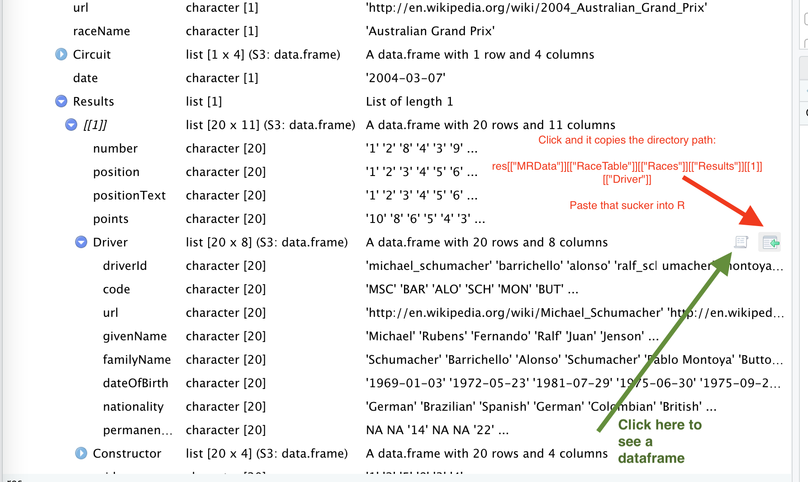

# R3: Gathering, Cleaning data, 2022

<br>    

**NICAR 2022: Atlanta, Georgia**   
ver. 3/4/2022

    Rob Wells, Ph.D.
    Philip Merrill College of Journalism
    University of Maryland
    robwells@umd.edu
    LinkedIn: https://www.linkedin.com/in/rob-wells-7929329/ 
    
<br> 


<br>   
<br> 

**Goals:**
    
   Pull data into R through various means, including accessing APIs and web URLs
   Clean and structure the data for analysis 
   
 

-- **What is an API**

APIs - basics   

    https://medium.com/@LewisMenelaws/a-beginners-guide-to-web-apis-and-how-they-will-help-you-23923a0da450

    A gentle introduction to APIs for data journalists
    https://trendct.org/2016/12/29/fetching-airport-delays-with-python-a-gentle-guide-to-apis-for-journalists/
  
Housekeeping
```{r}
setwd("C:/Users/nmradmin/Desktop/hands_on_classes/20220305_r_3_gathering_and_cleaning_data_saturday_repeat_3039")

```

# Import from an API

-- **Software: jsonlite**
```{r include=FALSE}
#background on tidyverse: https://www.tidyverse.org/packages/
# install.packages("formattable")
#install.packages("janitor")
#install.packages("tidyverse")
#install.packages("jsonlite")
library(tidyverse)
library(janitor)
library(lubridate)
library(jsonlite)
```

```{r}
vignette("json-apis", package = "jsonlite")

```

-- **Example: Racing Data**
```{r}
res <- fromJSON('http://ergast.com/api/f1/2004/1/results.json')
View(res)
```

-- **Nested list**

<br> 


<br>   
<br> 

-- **Click on green arrow icon and that will display path directory in the console in R Studio
    Copy that path into your code

-- **Unpack it**
```{r}
drivers <- res[["MRData"]][["RaceTable"]][["Races"]][["Results"]][[1]][["Driver"]]
```

```{r}
colnames(drivers)
```


# Vaccine Data API

-- **Arkansas Vaccine Data**

   1) Poorly documented by state!  
   2) One day shot of data


```{r}
## Retrieve County Vaccine Data from ADH FEED
#County vaccination json feed
#35 Variables

vaxjson <- fromJSON('https://services5.arcgis.com/vlhGQkz6fSnofVMD/ArcGIS/rest/services/ADH_COVID19_VACCINATIONS_BY_COUNTY/FeatureServer/0/query?where=0%3D0&objectIds=&time=&geometry=&geometryType=esriGeometryEnvelope&inSR=&spatialRel=esriSpatialRelIntersects&resultType=none&distance=0.0&units=esriSRUnit_Meter&returnGeodetic=false&outFields=*&returnGeometry=true&returnCentroid=false&featureEncoding=esriDefault&multipatchOption=xyFootprint&maxAllowableOffset=&geometryPrecision=&outSR=&datumTransformation=&applyVCSProjection=false&returnIdsOnly=false&returnUniqueIdsOnly=false&returnCountOnly=false&returnExtentOnly=false&returnQueryGeometry=false&returnDistinctValues=false&cacheHint=false&orderByFields=&groupByFieldsForStatistics=&outStatistics=&having=&resultOffset=&resultRecordCount=&returnZ=false&returnM=false&returnExceededLimitFeatures=true&quantizationParameters=&sqlFormat=none&f=pjson&token=')
View(vaxjson )
```


#Pulls in the data that matters to 'vax'
```{r}
vax <- vaxjson[["features"]][["attributes"]]
glimpse(vax)
```


```{r}
#Add system date
vax$date <- Sys.Date()

#clean column names
vax <- clean_names(vax)

#Translate column name jargon
vax <- vax %>% 
rename(Date = "date",
       County_Name = "adh_covid19_vac_join_county_nam", 
       County_Vax_Total =  "vac_demo_county_aggregate_count", 
       White_Total = "vac_demo_county_race0_total", 
       Black_Total= "vac_demo_county_race1_total",
       Native_American_Total = "vac_demo_county_race2_total", 
       Asian_Total = "vac_demo_county_race3_total", 
       Pacific_Islander_Total = "vac_demo_county_race4_total",
       Unk_Race_Total = "vac_demo_county_race5_total", 
       Other_Race_Total= "vac_demo_county_race6_total",
       Hispanic_Total= "vac_demo_county_ethnicity_hispa", 
       Dose_1 = "vac_demo_county_dose_one",
       Dose_2 = "vac_demo_county_dose_two", 
       Unk_Dose= "vac_demo_county_unk_dose",
       Partial_Vax= "vac_demo_county_partially_immun", 
       Fully_Vax = "vac_demo_county_fully_immunized", 
       Hispanic_Partial_Vax = "vac_demo_county_partially_hispa",
       Hispanic_Full_Vax = "vac_demo_county_fully_hispanic", 
       Population = "vac_demo_county_population", 
       County_Pct_Dose_1 = "vac_demo_county_percent_dose_1",
       County_Pct_Dose_2 = "vac_demo_county_percent_dose_2",
       County_Pct_Population = "vac_demo_county_percent_populat",
       White_Partial_Pct= "vac_demo_county_partially_white",
       Black_Partial_Pct= "vac_demo_county_partially_black",
       Asian_Partial_Pct = "vac_demo_county_partially_aian",
       Non_Hispanic_Partial_Pct= "vac_demo_county_partially_nhopi",
       White_Full_Pct = "vac_demo_county_fully_white", 
       Black_Full_Pct = "vac_demo_county_fully_black", 
       Asian_Full_Pct= "vac_demo_county_fully_aian", 
       Non_Hispanic_Full_Pct = "vac_demo_county_fully_nhopi")

head(vax)
```


```{r}
vax_summary <- vax %>% 
  select(County_Name, County_Vax_Total, Partial_Vax, Fully_Vax,Unk_Dose, Population, Date) 
```


```{r}
#Basic math
vax_summary <- vax_summary %>% 
  mutate(Full_Pct =(Fully_Vax/Population)) 
  
vax_summary$Full_Pct <- formattable::percent(vax_summary$Full_Pct, 1)

#Resort the table to emphasize the Full Pct
vax_summary <- vax_summary %>% 
   select(County_Name, Full_Pct, County_Vax_Total, Partial_Vax, Fully_Vax,Unk_Dose, Population, Date) 

head(vax_summary)

```

-- **Chart 15 counties with lowest vaccine percentage**
```{r}
vax_summary %>% 
  arrange(desc(Full_Pct)) %>% 
  slice_min(Full_Pct, n= 15) 
  
```


-- **Chart It**

```{r}
vax_summary %>% 
  arrange(desc(Full_Pct)) %>% 
  slice_min(Full_Pct, n= 15) %>% 
  #sandwich the ggplot code
  ggplot(aes(x = County_Name, y = Full_Pct, fill = Full_Pct)) +
  geom_col(position = "dodge") + 
  theme(legend.position = "none") +
   labs(title = "Lowest Vaccine Rates in Arkansas Counties", 
       subtitle = "Source: Ark Dept of Health, Feb 12, 2022",
       caption = "Graphic by Rob Wells",
       y="Pct Fully Vaccinated",
       x="")
```

-- **Clean Up the Chart**

```{r}
vax_summary %>% 
  arrange(desc(Full_Pct)) %>% 
  slice_min(Full_Pct, n= 15) %>% 
  #sandwich the ggplot code
  ggplot(aes(x = County_Name, y = Full_Pct, fill = Full_Pct)) +
  geom_col(position = "dodge") + 
  theme(legend.position = "none") +
  #flip the labels
  theme(axis.text.x = element_text(angle = 90, hjust = 1)) +
  #format the x axis. sets the grid to maximum 30%
    scale_y_continuous(limits=c(0, .5),labels = scales::percent) +
  labs(title = "Lowest Vaccine Rates in Arkansas Counties", 
       subtitle = "Source: Ark Dept of Health, Feb 12, 2022",
       caption = "Graphic by Rob Wells",
       y="Pct Fully Vaccinated",
       x="")
```


Feeds to homepage map
https://www.datawrapper.de/_/HZNsT/
This is autoloaded to Github via the vaccine_county.csv

Feeds to vaccine chart
https://www.datawrapper.de/_/dDKzc/

Documentation for live updated charts
https://academy.datawrapper.de/article/60-external-data-sources
https://academy.datawrapper.de/article/236-how-to-create-a-live-updating-symbol-map-or-choropleth-map

Definitions for the data feed
https://docs.google.com/spreadsheets/d/1gJ8aEnX5zmT5ru-WPJjBQ2gEEaGZ4vc_A8hgWK69IdE/edit?usp=sharing


# Analysis of San Francisco Police Calls for Service Data  

- **Here is the original dataset: 3,048,797 records**  

https://data.sfgov.org/Public-Safety/Police-Department-Calls-for-Service/hz9m-tj6z/data

-- **Access the API**

https://datasf.org/opendata/developers/

-- **Import from an API**

https://data.sfgov.org/resource/hz9m-tj6z.json

Load Data
```{r}
SF <- rio::import("SF_311_Jan29.xlsx", which = "SF Police_Department_Calls_for_") 

#At Home: See Appendix to load data at home from Internet

```

- **Clean column names, Process dates** 
```{r}
SF <- janitor::clean_names(SF)
#Process dates
SF$call_date2 <- ymd(SF$call_date)
SF$year <- year(SF$call_date2)
```

# Cleaning Dispositions

      Clean and structure the data you’ve gathered in preparation for analysis using tidyverse packages.


-- **Total by disposition**  
```{r}
Action <- SF %>% 
  count(disposition) %>% 
  arrange(desc(n))
head(Action)
```

-- **Decode Police Radio Codes**   

A guide to what these disposition codes mean   
```{r}
copspeak <- rio::import("Radio_Codes_2016.xlsx", which ="RadioCodes")
head(copspeak)

#In case the file isn't there:
#copspeak <- rio::import("https://github.com/profrobwells/Guest_Lectures/blob/master/Intro_to_R_2022/Radio_Codes_2016.xlsx?raw=true", which ="RadioCodes")

#HAN = Handled
#ADV = Advised
#GOA = Gone on arrival

#view(copspeak)


```


- **Serious Actions**: Create a table with the serious actions including citations and arrests police took in the dispositions  

Arrest, Cited, Criminal Activation, SF Fire Dept Medical Staff engaged
```{r}
Busted <- SF %>% 
  filter(disposition == "ARR" | disposition == "CIT" | disposition == "CRM" | disposition == "SFD") %>% 
  count(disposition) %>% 
  arrange(desc(n))
head(Busted)
```

Find out when nothing happened with the officer's investigation.
A table filtering the dispositions column to show "no disposition" or "gone on arrival"
```{r}
Nothing <- SF %>% 
  filter(disposition == "ND" | disposition == "GOA")
```


-- **Translate Cop Jargon to English**   

The disposition column is in cop-speak. We need to clean it up

Step #1: Use mutate to duplicate the column you want to mess with

-- **Mutate command**

    Create new column(s) in the data, or change existing column(s). 
    mutate() adds new variables and preserves existing
    Example:
    mtcars <- as.data.frame(mtcars)
    View(mtcars)
  
    mtcars2 <- mtcars %>% as_tibble() %>% mutate(
    cyl2 = cyl * 2,
    cyl4 = cyl2 * 2)
```{r}
SF <- SF %>% 
  mutate(disposition1 = disposition)
```

-- **Rename specific text strings**

Example:   

     str_replace_all(test.vector, pattern=fixed('-'),     replacement=fixed(':') )
     Details on string manipulation:  
     https://dereksonderegger.github.io/570L/13-string-manipulation.html

Replace ABA with "Abated"
```{r}
SF$disposition1 <- str_replace_all(SF$disposition1, pattern=fixed('ABA'), replacement=fixed('Abated') )
#Again with ADM
SF$disposition1 <- str_replace_all(SF$disposition1, pattern=fixed('ADM'), replacement=fixed('Admonished') )
```

--**Clean disposition types**

```{r}
SF <- SF %>%
   mutate(disposition1 = case_when(
     str_detect(disposition, "CIT") ~ "Cited",
     str_detect(disposition, "CRM") ~ "Criminal",
     str_detect(disposition, "GOA") ~ "Gone",
     str_detect(disposition, "HAN") ~ "Handled",
     str_detect(disposition, "NCR") ~ "No_Criminal",
     str_detect(disposition, "ND") ~ "No_Dispo",
     str_detect(disposition, "NOM") ~ "No_Merit",
     str_detect(disposition, "PAS") ~ "PlaceSecure",
     str_detect(disposition, "REP") ~ "Report",
     str_detect(disposition, "SFD") ~ "Medical",
     str_detect(disposition, "UTL") ~ "Unfound",
     str_detect(disposition, "VAS") ~ "Vehicle-Secure",
     str_detect(disposition, '22') ~ "Cancel",
     str_detect(disposition, "Not recorded") ~ "NotRecorded",
     str_detect(disposition, "CAN") ~ "Cancel",
     str_detect(disposition, "ADV") ~ "Advised",
     str_detect(disposition, "ARR") ~ "Arrest",
      TRUE ~ disposition1
   ))
```

Compare our renamed variables to the original disposition
```{r}
Action <- SF %>% 
  count(disposition1, disposition) %>% 
  arrange(desc(n))
head(Action)
```


Chart Dispositions  
```{r}
Action %>% 
  filter(n > 100) %>% 
  ggplot(aes(x = reorder(disposition1, n), y = n, fill=n)) + 
  geom_bar(stat = "identity", show.legend = FALSE) +
  coord_flip() +    #this makes it a horizontal bar chart instead of vertical
  labs(title = "Action on Homeless Calls, San Francisco", 
       subtitle = "SF PD Service Call Data, 3/2016-11/2019",
       caption = "Graphic by Wells",
       y="Number of Calls",
       x="Action")
```

# Cleaning Crime Data

- **Parse out crime type name**

-- **Tabulate types of events**

```{r}
Types <- SF %>% count(original_crime_type_name) %>% 
  group_by(original_crime_type_name) %>% 
  arrange(desc(n))
head(Types)
# 915/919
# 915 Sleeper 
# Some have commentary
# 915 Encampment
```

We need to unpack that

- **Cleaning Sequence**
```{r}
#convert all text to lowercase
SF$crime1 <- tolower(SF$original_crime_type_name)

#Replace / with a space
SF$crime1 <- gsub("/", " ", SF$crime1)

#Replace '
SF$crime1 <- gsub("'", "", SF$crime1)

#fix space in homeless complaint
SF$crime1 <- gsub("homeless complaint", "homeless_complaint", SF$crime1)

#split crime1 into three new columns
SF <- separate(data = SF, col = crime1, into = c("crime2", "crime3", "crime4"), sep = " ", extra = "merge", fill = "right")

```

For this lesson, we will clean just one column. See Appendix on the method to clean and construct a new dataframe with all of the columns

```{r}
#Clean Crime2
SF <- SF %>%
   mutate(crime_cleaned = case_when(
     str_detect(crime2, '919') ~ "sit_lying",
     str_detect(crime2, '915') ~ "homeless_complaint",
     str_detect(crime2, '915s') ~ "homeless_complaint",
     str_detect(crime2, '915x') ~ "homeless_complaint",  
     str_detect(crime2, '909') ~ "interview",
     str_detect(crime2, '902') ~ "aggress_solicit",
     str_detect(crime2, '811') ~ "intoxicated",
     str_detect(crime2, '601') ~ "trespasser",     
     str_detect(crime2, "aggressive") ~ "aggressive",
     str_detect(crime2, "chop shop") ~ "chop_shop",
     str_detect(crime2, "dog") ~ "dog",    
     str_detect(crime2, "drugs") ~ "drugs",    
     str_detect(crime2, "homeless_complaint") ~ "homeless_complaint",
     str_detect(crime2, "music") ~ "music",
     str_detect(crime2, "panhandling") ~ "panhandling",
     str_detect(crime2, "poss") ~ "possession",
     str_detect(crime2, "sleep") ~ "sleep",
     str_detect(crime2, "tent") ~ "tent",
     TRUE ~ ""
   ))
```


```{r}
#count the offenses
#remember this is a partial total
SF %>% 
  count(crime_cleaned) %>% 
  arrange(desc(n))

```

-- **Compare to Types Table**
```{r}
#Look at the Types table: some columns have one code, some have two.
Types %>% 
  distinct()
```

-- **Chart Crimes**

```{r}
SF %>% 
  count(crime_cleaned) %>% 
  filter(!crime_cleaned =="") %>% 
  filter(n > 30) %>% 
  ggplot(aes(x = reorder(crime_cleaned, n), y = n, fill=n)) + 
  geom_bar(stat = "identity", show.legend = FALSE) +
  coord_flip() +    #this makes it a horizontal bar chart instead of vertical
  labs(title = "Types of Complaints in 311 Calls", 
       subtitle = "SF PD Service Call Data, 3/2016-11/2019",
       caption = "Graphic by Wells",
       y="Types of Complaints",
       x="Action")
```


- **Question**: What is the trend for arrests over the time period?  

Process dates using lubidate
```{r}
SF <- SF %>% 
  mutate(yearmo = format(call_date, "%Y-%m"))
```

```{r}
SF %>% 
  filter(grepl("ARR", disposition)) %>%
  count(yearmo) %>% 
  group_by(yearmo) %>% 
  ggplot(aes(x = yearmo, y = n, fill=n)) +
  geom_bar(stat = "identity", show.legend = FALSE) +
  geom_smooth(method = lm, se=FALSE, color = "red") +
  theme(axis.text.x = element_text(angle=90)) +
  #Changes angle of x axis labels
  #coord_flip() +    #this makes it a horizontal bar chart instead of vertical
  labs(title = "Arrest Trends on Homeless Calls in San Francisco", 
       subtitle = "Arrests Based on SF PD Service Call Data by Month 2017-2019",
       caption = "Graphic by Wells",
       y="Number of Calls",
       x="Year")
```

- **Question**: What are the hours most likely for complaints?    
```{r}
#format to hours
SF$hour <- hour(SF$call_date_time)
SF %>% 
  count(hour) %>% 
  group_by(hour) %>% 
  ggplot(aes(x = hour, y = n, fill=n)) +
  geom_bar(stat = "identity", show.legend = FALSE) +
  theme(axis.text.x = element_text(angle=90)) +
  #Changes angle of x axis labels
  #coord_flip() +    #this makes it a horizontal bar chart instead of vertical
  labs(title = "Hours of Homeless Calls, San Francisco", 
       subtitle = "SF PD Service Call Data by Month 2017-2019",
       caption = "Graphic by Wells",
       y="Number of Calls",
       x="Hour")  
```

# Part 5: Using Mutate, Pct Calcs

Chart the number of calls by year and month
```{r}
SF %>% 
  count(yearmo) %>% 
  group_by(yearmo) %>% 
  ggplot(aes(x = yearmo, y = n, fill=n)) +
  geom_bar(stat = "identity") +
  theme(axis.text.x = element_text(angle=90)) +
  #Changes angle of x axis labels
  #coord_flip() +    #this makes it a horizontal bar chart instead of vertical
  labs(title = "Homeless Calls After 2017, San Francisco", 
       subtitle = "SF PD Service Call Data by Month 2017-2019",
       caption = "Graphic by Wells",
       y="Number of Calls",
       x="Year")
```
Build a summary table with the days of the week with the greatest
number of calls. Create a graphic. Then build a table to see if the complaints vary by day

```{r}
SF <- SF %>% 
  mutate(weekday = wday(call_date, label=TRUE, abbr=FALSE))
Weekday_Count <- SF %>%
  select(weekday, crime_id) %>%
  count(weekday) %>%
  arrange(desc(n))
```
Graphic of calls by weekdays

```{r}
Weekday_Count %>% 
  ggplot(aes(x = weekday, y = n, fill=n)) +
  geom_bar(stat = "identity", show.legend = FALSE) +
  theme(axis.text.x = element_text(angle=90)) +
  #Changes angle of x axis labels
  #coord_flip() +    #this makes it a horizontal bar chart instead of vertical
  labs(title = "Homeless Calls By Weekday in San Francisco", 
       subtitle = "SF PD Service Call Data 2017-2019",
       caption = "Graphic by Moore and Seiter",
       y="Number of Calls",
       x="Weekday")
```


# Appendix


#At Home: Load data at home from Internet
```{r}
SF <- rio::import("https://github.com/profrobwells/HomelessSP2020/blob/master/Data/SF_311_Jan29.xlsx?raw=true", which = "SF Police_Department_Calls_for_") 
```


#police radio codes data
https://data.sfgov.org/api/views/hz9m-tj6z/files/b60ee24c-ae7e-4f0b-a8d5-8f4bd29bf1de?download=true&filename=Radio%20Codes%202016.xlsx


### How to Clean all of the Crime Columns

- **Cleaning Sequence**
```{r}
#convert all text to lowercase
SF$crime1 <- tolower(SF$original_crime_type_name)

#Replace / with a space
SF$crime1 <- gsub("/", " ", SF$crime1)

#Replace '
SF$crime1 <- gsub("'", "", SF$crime1)

#fix space in homeless complaint
SF$crime1 <- gsub("homeless complaint", "homeless_complaint", SF$crime1)

#split crime1 into three new columns
SF <- separate(data = SF, col = crime1, into = c("crime2", "crime3", "crime4"), sep = " ", extra = "merge", fill = "right")

```

For this lesson, we will clean just one column. See Appendix on the method to clean and construct a new dataframe with all of the columns

```{r}
#Clean Crime2
SF <- SF %>%
   mutate(crime_cleaned = case_when(
     str_detect(crime2, '919') ~ "sit_lying",
     str_detect(crime2, '915') ~ "homeless_complaint",
     str_detect(crime2, '915s') ~ "homeless_complaint",
     str_detect(crime2, '915x') ~ "homeless_complaint",  
     str_detect(crime2, '909') ~ "interview",
     str_detect(crime2, '902') ~ "aggress_solicit",
     str_detect(crime2, '811') ~ "intoxicated",
     str_detect(crime2, '601') ~ "trespasser",     
     str_detect(crime2, "aggressive") ~ "aggressive",
     str_detect(crime2, "chop shop") ~ "chop_shop",
     str_detect(crime2, "dog") ~ "dog",    
     str_detect(crime2, "drugs") ~ "drugs",    
     str_detect(crime2, "homeless_complaint") ~ "homeless_complaint",
     str_detect(crime2, "music") ~ "music",
     str_detect(crime2, "panhandling") ~ "panhandling",
     str_detect(crime2, "poss") ~ "possession",
     str_detect(crime2, "sleep") ~ "sleep",
     str_detect(crime2, "tent") ~ "tent",
     TRUE ~ ""
   ))
```


```{r}
#Clean Crime3
SF <- SF %>%
   mutate(crime_cleaned1 = case_when(
     str_detect(crime3, '919') ~ "sit_lying",
     str_detect(crime3, '915') ~ "homeless_complaint",
     str_detect(crime3, '915s') ~ "homeless_complaint",
     str_detect(crime3, '915x') ~ "homeless_complaint",  
     str_detect(crime3, '909') ~ "interview",
     str_detect(crime3, '902') ~ "aggress_solicit",
     str_detect(crime3, '811') ~ "intoxicated",
     str_detect(crime3, '601') ~ "trespasser",     
     str_detect(crime3, "aggressive") ~ "aggressive",
     str_detect(crime3, "chop shop") ~ "chop_shop",
     str_detect(crime3, "dog") ~ "dog",    
     str_detect(crime3, "drugs") ~ "drugs",    
     str_detect(crime3, "homeless_complaint") ~ "homeless_complaint",
     str_detect(crime3, "music") ~ "music",
     str_detect(crime3, "panhandling") ~ "panhandling",
     str_detect(crime3, "poss") ~ "possession",
     str_detect(crime3, "sleep") ~ "sleep",
     str_detect(crime3, "tent") ~ "tent",
     TRUE ~ ""
   ))
```


```{r}
#Clean Crime4
SF <- SF %>%
   mutate(crime_cleaned2 = case_when(
     str_detect(crime4, '919') ~ "sit_lying",
     str_detect(crime4, '915') ~ "homeless_complaint",
     str_detect(crime4, '915s') ~ "homeless_complaint",
     str_detect(crime4, '915x') ~ "homeless_complaint",  
     str_detect(crime4, '909') ~ "interview",
     str_detect(crime4, '902') ~ "aggress_solicit",
     str_detect(crime4, '811') ~ "intoxicated",
     str_detect(crime4, '601') ~ "trespasser",     
     str_detect(crime4, "aggressive") ~ "aggressive",
     str_detect(crime4, "chop shop") ~ "chop_shop",
     str_detect(crime4, "dog") ~ "dog",    
     str_detect(crime4, "drugs") ~ "drugs",    
     str_detect(crime4, "homeless_complaint") ~ "homeless_complaint",
     str_detect(crime4, "music") ~ "music",
     str_detect(crime4, "panhandling") ~ "panhandling",
     str_detect(crime4, "poss") ~ "possession",
     str_detect(crime4, "sleep") ~ "sleep",
     str_detect(crime4, "tent") ~ "tent",
     TRUE ~ ""
   ))
```

--**Create a New Dataframe to Tabulate the Crimes**
```{r}
#Three mini dataframes with two columns
crime1 <- SF %>% 
  select(report_date, crime_cleaned)
crime2 <- SF %>% 
  select(report_date, crime_cleaned1) %>% 
  rename(crime_cleaned = crime_cleaned1)
crime3 <- SF %>% 
  select(report_date, crime_cleaned2) %>% 
  rename(crime_cleaned = crime_cleaned2)

#Create a new dataframe called Total_Calls_Master
Total_Calls_Master <- rbind(crime1, crime2, crime3)

#filter blank values, rename columns
Total_Calls_Master <- Total_Calls_Master %>% 
  filter(!crime_cleaned=="") %>% 
  rename(Date=report_date, Complaint = crime_cleaned)

#export
write_csv(Total_Calls_Master, "Total_Calls_Master.csv")
```
--**Fact Check**
```{r}
x <- SF %>% 
  select(crime_cleaned) %>% 
  count(crime_cleaned) %>% 
  arrange(desc(n))
head(x)
```


```{r}
Crime_Sums <- Total_Calls_Master %>% 
  select(Complaint) %>% 
  count(Complaint) %>% 
  arrange(desc(n))
head(Crime_Sums)
```

Make into html table
```{r}
#install.packages("kableExtra")
library(kableExtra)
```

```{r}
#This makes html tables called "kables"
Crime_Sums %>% 
  kable() %>%
  kable_styling("striped")
```


<br>  
<br> 


-**30**