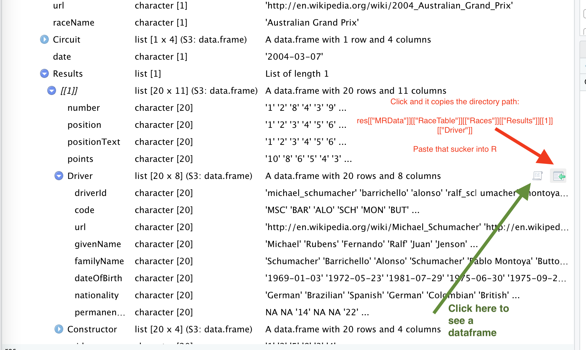

::: {style="text-align: center; color: #337DFF;"}
# Data Gathering & Cleaning, Basics of APIs
:::

::: {style="text-align: center;"}

:::

```         
Rob Wells, Ph.D.
Philip Merrill College of Journalism
University of Maryland
robwells@umd.edu
LinkedIn: https://www.linkedin.com/in/rob-wells-7929329/ 
ver. 5/29/2024 
```

<br>

## Learning Goals

```         
Understand the basics of APIs.  
Gather data in R through APIs and web URLs. 
Use techniques to clean and structure data for analysis 
```

<br> <br>

#### APIs - basics

[A beginner's guide to
APIs](https://medium.com/@LewisMenelaws/a-beginners-guide-to-web-apis-and-how-they-will-help-you-23923a0da450)

[A gentle introduction to APIs for data
journalists](https://trendct.org/2016/12/29/fetching-airport-delays-with-python-a-gentle-guide-to-apis-for-journalists/)

### Import from an API

```{r include=FALSE}
#background on tidyverse: https://www.tidyverse.org/packages/
# install.packages("formattable")
#install.packages("janitor")
#install.packages("tidyverse")
#install.packages("jsonlite")

library(tidyverse)
library(janitor)
library(lubridate)
library(jsonlite)
library(tidyr)
```

**Details about software: jsonlite**

```{r}
vignette("json-apis", package = "jsonlite")

```

**Example: Racing Data**

```{r}
res <- fromJSON('http://ergast.com/api/f1/2004/1/results.json')
#head(res)
```

**Nested list**

<br>


<br>\
<br>

**Click on green arrow icon and that will display path directory in the
console in R Studio** Copy that path into your code

**Unpack it**

```{r}
drivers <- res[["MRData"]][["RaceTable"]][["Races"]][["Results"]][[1]][["Driver"]]
```

```{r}
colnames(drivers)
```

<br>

### Example: Arkansas Agent and Broker Data API

[Here's the source data from the state of
Arkansas](https://services.arcgis.com/PwY9ZuZRDiI5nXUB/ArcGIS/rest/services/Agent_And_Broker_Locations/FeatureServer/layers)

```{r}
brokerjson <- fromJSON('https://services.arcgis.com/PwY9ZuZRDiI5nXUB/ArcGIS/rest/services/Agent_And_Broker_Locations/FeatureServer/0/query?where=0%3D0&objectIds=&time=&geometry=&geometryType=esriGeometryEnvelope&inSR=&spatialRel=esriSpatialRelIntersects&resultType=none&distance=0.0&units=esriSRUnit_Meter&relationParam=&returnGeodetic=false&outFields=Last_Name%2CFirst_Name%2CMiddle_Name%2CEmail_Address%2CAddress%2CState%2CZip%2CPhone%2CLic_Type%2CEXCEL_POINT_Y%2CEXCEL_POINT_X%2CFID&returnGeometry=true&featureEncoding=esriDefault&multipatchOption=xyFootprint&maxAllowableOffset=&geometryPrecision=&outSR=&defaultSR=&datumTransformation=&applyVCSProjection=false&returnIdsOnly=false&returnUniqueIdsOnly=false&returnCountOnly=false&returnExtentOnly=false&returnQueryGeometry=false&returnDistinctValues=false&cacheHint=false&orderByFields=&groupByFieldsForStatistics=&outStatistics=&having=&resultOffset=&resultRecordCount=&returnZ=false&returnM=false&returnExceededLimitFeatures=false&quantizationParameters=&sqlFormat=none&f=pjson&token=')
#head(brokerjson )
```

**Pulls in the data that matters to 'broker'**

```{r}
broker <- brokerjson[["features"]][["attributes"]]
glimpse(broker)
```

**Add system date, clean**

```{r}
broker$date <- Sys.Date()

#clean column names
broker <- clean_names(broker)
```

**Create a new column with city name**

**We split the column at the comma to create a new city column**

```{r warning=FALSE}
broker <- separate(broker, col = address, into = c("street", "city"), sep = ",")

```

**Create a table: Count cities**

```{r}
#call your new table broker_city


```

**Chart It**

```{r}
broker_city %>% 
  slice_max(total, n= 20) %>% 
  arrange(desc(total)) %>% 
  #sandwich the ggplot code
  ggplot(aes(x = city, y = total, fill = total)) +
  geom_col(position = "dodge") + 
  theme(legend.position = "none") +
  theme(axis.text.x = element_text(angle=90)) +
   labs(title = "Insurance brokers in Arkansas", 
       subtitle = "Source: Arkansas public records, 2024",
       caption = "Graphic by Rob Wells, 5/29/2024",
       y="Number brokers",
       x="")
```

**Reorder the Chart**

```{r}
broker_city %>% 
  slice_max(total, n= 20) %>% 
  arrange(desc(total)) %>% 
  #sandwich the ggplot code
  ggplot(aes(x = reorder(city, -total), y = total, fill = total)) +
  geom_col(position = "dodge") + 
  theme(legend.position = "none") +
  theme(axis.text.x = element_text(angle=90)) +
   labs(title = "Insurance brokers in Arkansas", 
       subtitle = "Source: Arkansas public records, 2024",
       caption = "Graphic by Rob Wells",
       y="Number brokers",
       x="")
```

## Analysis of San Francisco Police Calls for Service Data

[**Here is the original dataset: 3,048,797
records**](https://data.sfgov.org/Public-Safety/Police-Department-Calls-for-Service/hz9m-tj6z/data)

[**Access the API**](https://datasf.org/opendata/developers/)

[**Import from an API**](https://data.sfgov.org/resource/hz9m-tj6z.json)

**Load Data**

```{r}
SF <- rio::import("https://docs.google.com/spreadsheets/d/1-nkosLJKkfeLSl-UG82DDyiEw5-62kX2alS6ICG9iuk/edit#gid=552005485", sheet = "SF Police_Department_Calls_for_") 
```

**Clean column names, Process dates**

```{r}
#This cleans column names
SF <- janitor::clean_names(SF)
#This processes dates for analysis
SF$call_date2 <- mdy(SF$call_date)
#This creates a new column for year
SF$year <- year(SF$call_date2)
```

### Cleaning Dispositions

**Total by disposition: Count**

```{r}

#put the count total in an object called Action

```

**Decode Police Radio Codes**

**A guide to what these disposition codes mean**

```{r}
copspeak <- rio::import("https://docs.google.com/spreadsheets/d/1l86DSZ5LWxlXTliXu06Iai0DiYXlJE4hUYBeddL0XXg/edit#gid=554934632", sheet ="RadioCodes")
#head(copspeak)

#HAN = Handled
#ADV = Advised
#GOA = Gone on arrival
```

**Translate Cop Jargon to English**

The disposition column is in cop-speak. We need to clean it up

Step #1: Use mutate to duplicate the column you want to mess with

**Mutate command**

```         
Create new column(s) in the data, or change existing column(s). 
mutate() adds new variables and preserves existing
Example:
mtcars <- as.data.frame(mtcars)
View(mtcars)

mtcars2 <- mtcars %>% as_tibble() %>% mutate(
cyl2 = cyl * 2,
cyl4 = cyl2 * 2)
```

```{r}
SF <- SF %>% 
  mutate(disposition1 = disposition)
```

### Rename specific text strings

Example:

```         
 str_replace_all(test.vector, pattern=fixed('-'),     replacement=fixed(':') )
 [Details on string manipulation - follow this link](    https://dereksonderegger.github.io/570L/13-string-manipulation.html)
```

**Replace ABA with "Abated"**

```{r}
SF$disposition1 <- str_replace_all(SF$disposition1, pattern=fixed('ABA'), replacement=fixed('Abated') )
#Again with ADM
SF$disposition1 <- str_replace_all(SF$disposition1, pattern=fixed('ADM'), replacement=fixed('Admonished') )
```

**Clean disposition types**

case_when searches for an item and transforms the data into a new column
using mutate

```{r}
SF <- SF %>%
   mutate(disposition1 = case_when(
     str_detect(disposition, "CIT") ~ "Cited",
     str_detect(disposition, "CRM") ~ "Criminal",
     str_detect(disposition, "GOA") ~ "Gone",
     str_detect(disposition, "HAN") ~ "Handled",
     str_detect(disposition, "NCR") ~ "No_Criminal",
     str_detect(disposition, "ND") ~ "No_Dispo",
     str_detect(disposition, "NOM") ~ "No_Merit",
     str_detect(disposition, "PAS") ~ "PlaceSecure",
     str_detect(disposition, "REP") ~ "Report",
     str_detect(disposition, "SFD") ~ "Medical",
     str_detect(disposition, "UTL") ~ "Unfound",
     str_detect(disposition, "VAS") ~ "Vehicle-Secure",
     str_detect(disposition, '22') ~ "Cancel",
     str_detect(disposition, "Not recorded") ~ "NotRecorded",
     str_detect(disposition, "CAN") ~ "Cancel",
     str_detect(disposition, "ADV") ~ "Advised",
     str_detect(disposition, "ARR") ~ "Arrest",
      TRUE ~ disposition1
   ))
```

**Compare our renamed variables to the original disposition**

```{r}
Action <- SF %>% 
  count(disposition1, disposition) %>% 
  arrange(desc(n))
#head(Action)
```

### Chart Dispositions

```{r}
Action %>% 
  filter(n > 100) %>% 
  ggplot(aes(x = reorder(disposition1, n), y = n, fill=n)) + 
  geom_bar(stat = "identity", show.legend = FALSE) +
  coord_flip() +    #this makes it a horizontal bar chart instead of vertical
  labs(title = "Action on Homeless Calls, San Francisco", 
       subtitle = "SF PD Service Call Data, 3/2016-11/2019",
       caption = "Graphic by Wells",
       y="Number of Calls",
       x="Action")
```

# Cleaning Crime Data

**Parse out crime type name & tabulate events**

```{r}
Types <- SF %>% count(original_crime_type_name) %>% 
  group_by(original_crime_type_name) %>% 
  arrange(desc(n))
#head(Types)
# 915/919
# 915 Sleeper 
# Some have commentary
# 915 Encampment
```

**Cleaning Sequence**

```{r}
#convert all text to lowercase
SF$crime1 <- tolower(SF$original_crime_type_name)

#Replace / with a space
SF$crime1 <- gsub("/", " ", SF$crime1)

#Replace '
SF$crime1 <- gsub("'", "", SF$crime1)

#fix space in homeless complaint
SF$crime1 <- gsub("homeless complaint", "homeless_complaint", SF$crime1)

#split crime1 into three new columns
SF <- separate(data = SF, col = crime1, into = c("crime2", "crime3", "crime4"), sep = " ", extra = "merge", fill = "right")

```

For this lesson, we will clean just one column.

```{r}
#Clean Crime2
SF <- SF %>%
   mutate(crime_cleaned = case_when(
     str_detect(crime2, '919') ~ "sit_lying",
     str_detect(crime2, '915') ~ "homeless_complaint",
     str_detect(crime2, '915s') ~ "homeless_complaint",
     str_detect(crime2, '915x') ~ "homeless_complaint",  
     str_detect(crime2, '909') ~ "interview",
     str_detect(crime2, '902') ~ "aggress_solicit",
     str_detect(crime2, '811') ~ "intoxicated",
     str_detect(crime2, '601') ~ "trespasser",     
     str_detect(crime2, "aggressive") ~ "aggressive",
     str_detect(crime2, "chop shop") ~ "chop_shop",
     str_detect(crime2, "dog") ~ "dog",    
     str_detect(crime2, "drugs") ~ "drugs",    
     str_detect(crime2, "homeless_complaint") ~ "homeless_complaint",
     str_detect(crime2, "music") ~ "music",
     str_detect(crime2, "panhandling") ~ "panhandling",
     str_detect(crime2, "poss") ~ "possession",
     str_detect(crime2, "sleep") ~ "sleep",
     str_detect(crime2, "tent") ~ "tent",
     TRUE ~ ""
   ))
```

**Count crime_cleaned**

```{r}
#remember this is a partial total
#arrange the results in descending order

```

**Compare to Types Table**

```{r}
#Look at the Types table: some columns have one code, some have two.
Types %>% 
  distinct()
```

**Chart Crimes**

```{r}
SF %>% 
  count(crime_cleaned) %>% 
  filter(!crime_cleaned =="") %>% 
  filter(n > 30) %>% 
  ggplot(aes(x = reorder(crime_cleaned, n), y = n, fill=n)) + 
  geom_bar(stat = "identity", show.legend = FALSE) +
  coord_flip() +    #this makes it a horizontal bar chart instead of vertical
  labs(title = "Types of Complaints in 311 Calls", 
       subtitle = "SF PD Service Call Data, 3/2016-11/2019",
       caption = "Graphic by Wells",
       y="Types of Complaints",
       x="Action")
```

**Arrest Trend: What is the trend for arrests over the time period?**

Process dates using lubidate

```{r}
SF <- SF %>% 
  mutate(yearmo = format(call_date2, "%Y-%m"))
```

```{r}
SF %>% 
  filter(grepl("ARR", disposition)) %>%
  count(yearmo) %>% 
  group_by(yearmo) %>% 
  ggplot(aes(x = yearmo, y = n, fill=n)) +
  geom_bar(stat = "identity", show.legend = FALSE) +
  geom_smooth(method = lm, se=FALSE, color = "red") +
  theme(axis.text.x = element_text(angle=90)) +
  #Changes angle of x axis labels
  #coord_flip() +    #this makes it a horizontal bar chart instead of vertical
  labs(title = "Arrest Trends on Homeless Calls in San Francisco", 
       subtitle = "Arrests Based on SF PD Service Call Data by Month 2017-2019",
       caption = "Graphic by Wells",
       y="Number of Calls",
       x="Year")
```

**Hours when people complain?**

```{r}
#format to hours
SF$date_time <- mdy_hm(SF$call_date_time)
SF$hour <- hour(SF$date_time)
SF %>% 
  count(hour) %>% 
  group_by(hour) %>% 
  ggplot(aes(x = hour, y = n, fill=n)) +
  geom_bar(stat = "identity", show.legend = FALSE) +
  theme(axis.text.x = element_text(angle=90)) +
  #Changes angle of x axis labels
  #coord_flip() +    #this makes it a horizontal bar chart instead of vertical
  labs(title = "Hours of Homeless Calls, San Francisco", 
       subtitle = "SF PD Service Call Data by Month 2017-2019",
       caption = "Graphic by Wells",
       y="Number of Calls",
       x="Hour")  
```

### Your Turn

```{r}
#Find out when nothing happened with the officer's investigation.
#A table filtering the dispositions column to show "no disposition" or "gone on arrival"


```

```{r}
#**Serious Actions**: Create a table with the serious actions including citations and arrests police took in the dispositions  

#Arrest, Cited, Criminal Activation, SF Fire Dept Medical Staff engaged


```

```{r}
#Chart the number of calls by year and month


```

```{r}
#Build a summary table with the days of the week with the greatest
#number of calls. Create a graphic. Then build a table to see if the complaints vary by day


```

**Super Bonus Nerd Zone**

```{r}
#Clean all of the Crime Columns
#In the example above, we cleaned just the crime2 column. 
#Now do the same with "crime3", "crime4" and join them together into a combined dataframe


```

<br>

### Appendix

[Police radio codes
data](https://data.sfgov.org/api/views/hz9m-tj6z/files/b60ee24c-ae7e-4f0b-a8d5-8f4bd29bf1de?download=true&filename=Radio%20Codes%202016.xlsx)

<br>

::: {style="text-align: center; color: #337DFF;"}
--30--
:::
