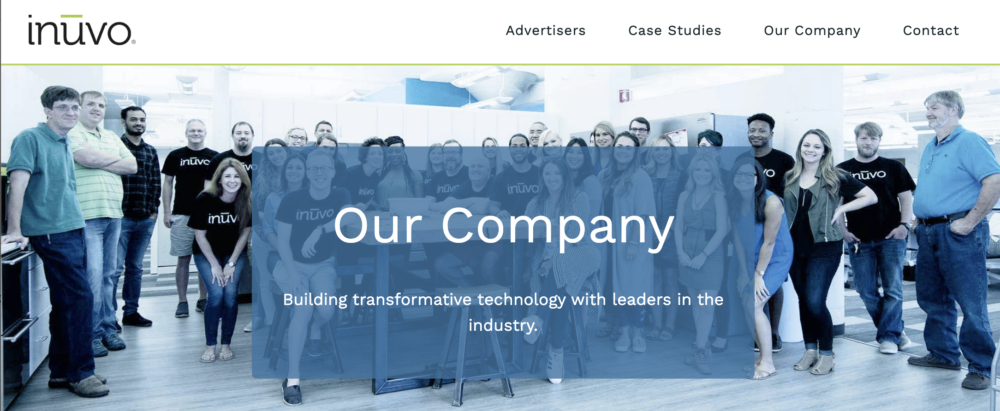
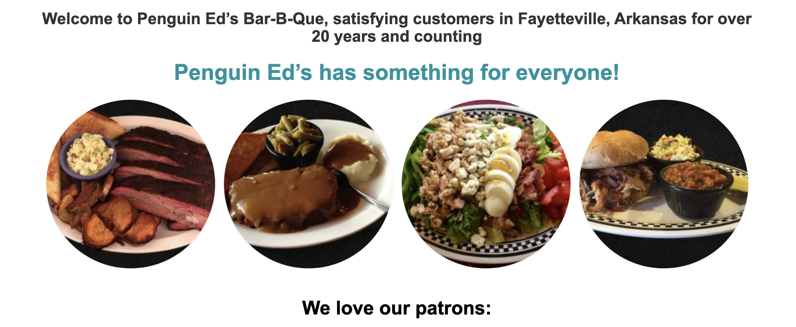

## 2021 National Press Foundation Corporate Accountability Seminar   
   
    
   

**Today's Presentation** 

**<http://bit.do/companies_PPP>**

 

**Presenter**

- Rob Wells, Ph.D., University of Arkansas, Fayetteville, AR    
- Author, The Enforcers: How Little-Known Trade Reporters Exposed the Keating Five and Advanced Business Journalism  
- <https://www.press.uillinois.edu/books/catalog/39sqh8ta9780252042942.html>

 
   

 

**This 45-minute hands-on session will show journalists how to navigate Securities and Exchange Commission filings and conduct basic background research on corporations.** 
 
 
Learning Outcome: Journalists will learn how to retrieve details on revenues, contracts, employment and business ownership. 
---

## Corporate Research Overview   

### Public v. Private Companies   

> There are approximately 15,000 U.S. public
companies, but some six million firms are
privately held.  

> Small and privately held firms employ more
than half of the workforce and account for
more than half of the country’s output.   

> This SBA list will primarily have private companies
> [Speadsheet with PPP Recipients $150k and Above](https://sba.app.box.com/s/wz72fqag1nd99kj3t9xlq49deoop6gzf){target="_blank"}

## SEC Filings: The Basics  

SEC History: Depression-era agency to police stock market. Required system of information disclosures so investors and public will understand risks. Self-policing concept backed up by civil enforcement powers.   

Every publicly traded company files annual reports, proxy statements, and periodic disclosures about their finances and major business developments.

>SEC Edgar Database of Corporate Filings  
--"Electronic Data Gathering, Analysis, and Retrieval"  
--Executive pay, summary of big lawsuits, contracts, latest business information, finances  

> [Search for SEC Edgar Documents Here: "CNTL" + click for a New Tab](https://www.sec.gov/edgar/searchedgar/companysearch.html){target="_blank"}

> **Major documents**   
  + Breaking corporate news, earnings (8-K)   
  + Executive Pay (Form Def 14, 10-K)   
  + In-Depth Profits/Losses (Form 10-Q)   
  + Executive bios, photos (10-K, Def 14)   
  + Lawsuit summaries (10-Q, 10-K, 8-K)   

**Example: INUVO, INC**     
  + Struggling Little Rock tech company, received $1.1 Mln PPP Loan. Details from SBA document:      
  + LoanRange: $1-2 million    
  + INUVO, INC    
  + 500 PRESIDENT CLINTON AVE    
  + LITTLE ROCK	AR	72201	541810    
  + JobsRetained: 61	   
  + DateApproved: 4/8/20    
  + Lender: Relyance Bank, National Association    
  + Details from:       
> [PPP Recipients $150k and Above](https://sba.app.box.com/s/wz72fqag1nd99kj3t9xlq49deoop6gzf){target="_blank"}

**Look Up Inuvo, Inc 10-K for 2020**

> [SEC Edgar: "CNTL" + click for a New Tab](https://www.sec.gov/edgar/searchedgar/companysearch.html){target="_blank"}

> **Key Points from the 10-K**:  
  + Ticker Symbol: INUV   
  + Business: The context and overview    
  + Risk Factors: What Management Fears    
  + Legal Proceedings: Lawsuits    
  + Management Discussion and Analysis: The story    
  + Selected Financial Data: Revenues, Net Income    
  + Directors, Officers: Who Runs The Show   
  + Executive Compensation: Paychecks for Five Top Officers   
  + Beneficial Owners: Who Calls the Shots   
  + Exhibits, financial statements: Details on contracts   

> **Building the Story. Key Facts From Inuvo 10-K**:         
+ Inuvo is a technology company that develops and sells information technology solutions for marketing.   
+ Long-standing relationships with Yahoo!, Google and Microsoft Online     
+ April 30, 2020: 64 full-time employees      
+ Web site address is www.inuvo.com     
+ "The COVID-19 pandemic could have a material adverse impact on our business, results of operations and financial condition."    

**Red Flag**   
  1) *"material adverse impact" is a major warning of a significant business risk.*

>**More from Inuvo 10-K**     
  + "Beginning in late April 2020, we experienced a significant reduction in demand (marketing budgets) within the ValidClick business."      
  + "We would expect to see less advertising demand from the travel, leisure and hospitality verticals."      
  + "Our auditors have raised substantial doubts as to our ability to continue as a going concern... We have sustained recurring losses from operations and have a net capital deficiency."     
  + Reliant upon Yahoo! and Google for most of our revenue. During 2019 they accounted for 64.4%, and 14.1% of our revenues, respectively.      
  
**More Red Flags**    
  1) *auditors warning about "ability to continue as a going concern" is a major warning about future survival*   
  2) *heavy reliance on two companies for 78.5% of revenues*    
  3) *tied to travel, hospitality industry, hardest hit in Covid-19 pandemic*    
  
>**And Still More from Inuvo 10-K **   
  + March 12, 2020: Hitachi provided $5,000,000 line of credit commitment.          
  + April 2020, obtained unsecured Paycheck Protection Program loan... of $1.1 million which we are using primarily for payroll costs.   
  + Our net working capital was negative $7.5 million as of December 31, 2019. During March 2020 and April 2020 we raised approximately $1.5 million of working capital through the sale of our securities and in April 2020 we obtained the PPP Loan of $1.1 million.   
  + For the year ended December 31, 2019, we reported a net loss of $4,488,107 and net cash used in operating activities of $5,338,383.   

**More Red Flags**    
  1) *Right before the pandemic blew up, company went heavily in debt: $5 million loan*   
  2) *Scrambling to raise money: sold $1.5 million in stock in March-April*     
  3) *Inuvo lost $4.5 million in 2019*  
  

> **Takeaways**:   
  + Small company struggling to stay in business.  
  + Rising Debt Load: Net Interest Expense   
  + Expenses Rising    
  + How did a struggling small company get a PPP loan?  
  
### Special Edgar Tricks: Search for Your State, Zip Code     
> [Customized Edgar Search: "CNTL" + click for a New Tab](http://www.sec.gov/cgi-bin/srch-edgar){target="_blank"}    
  + state = AR   
  + Form-Type = 10-K    
  + Zip = 72701    
  + Background: Construct complex specific Edgar searches: <https://www.sec.gov/edgar/searchedgar/edgarzones.htm>    
  + Background: Boolean Operators  <https://www.sec.gov/edgar/searchedgar/search_help.htm>  

    
   
*This is a sample custom Edgar search by state*  

>**Another Example**:   
  + City = pittsburgh TYPE = 10-Q     
  + All 10-Q filings from Pittsburgh-based companies      
  + Regional search: By zip code with a wildcard    
  + Zip = 2964*   
  + Search Form-Type = D to find investment activity in your community.
  + Startups may sell securities to outside “accredited” investors (banks, insurance companies or sophisticated investors) through venture capital, private placements and similar arrangements.   

> **How I found Inuvo**     
  + Constructed an Edgar search state = AR Form-Type = 10-K      
  + [Customized Edgar Search: "CNTL" + click for a New Tab](http://www.sec.gov/cgi-bin/srch-edgar){target="_blank"}        
  + This provided a list of all current public companies in Arkansas     
  + Pulled up SBA list, sorted by Arkansas, loans of $1 million or more    
  + [PPP Recipients $150k and Above](https://sba.app.box.com/s/wz72fqag1nd99kj3t9xlq49deoop6gzf){target="_blank"}       
  + Yes, there probably is a better way, but that's what I did.

   

## Researching Private Companies

   

More detailed presentation     
> [Who Owns My Dive Bar?: "CNTL" + click for a New Tab](https://docs.google.com/presentation/d/1hcKDYeR93QtfQYnJHuRyvEGwe2lONXJM/edit#slide=id.p28){target="_blank"}

**Staircase Method**    
  Business Charter, Property Tax Records, Property Search, UCC Filings   

> **First Question:**   
  + Where does the business intersect with government?     
  + That’s where you find the paper.     
  + You will need to dig in multiple places to get a complete picture.     

>**Staircase**     
  + 1) Get the names    
  + 2) Get the address    
  + 3) Get the owners     
      + Use this information to      
        --Get the property tax record. Find neighbors to talk to    
        --Get the property transaction. Find the seller to speak with     

>  DNB   
    + Useful to get *correct spellings* of businesses with multiple locations   
    + Test: "Penguin Ed's"  - great barbecue place.    
> [Search DNB database: "CNTL" + click for a New Tab](http://www.dnb.com/){target="_blank"}    

    
  
>**Other Business Search Resources:**   
    [For international company searches: "CNTL" + click for a New Tab](https://corporateinformation.com/Country-Industry-Research-Links.aspx){target="_blank"}   

### Business Charter Records  
  > Charters Identify Owner and Partners   
  > [Search a business' charter in Maryland. "CNTL" + click for a New Tab](https://egov.maryland.gov/businessexpress/entitysearch){target="_blank"}   

>**Property Tax Records**   
  + [MD Tax Collection Agencies "CNTL" + click for a New Tab](https://dat.maryland.gov/realproperty/Pages/Local-Tax-Billing-Collection-Offices.aspx){target="_blank"}    
  + [Anne Arundel County, Md. Real Estate Tax Search. "CNTL" + click for a New Tab](https://aacounty.munisselfservice.com/citizens/RealEstate/Default.aspx?mode=new){target="_blank"}     
  + [Tips on Searching: "CNTL" + click for a New Tab](https://dat.maryland.gov/realproperty/Documents/SearchHelp.pdf){target="_blank"}      
    

>**Questions**    
   + Who’s Paying the Tax Bill? It may be someone else besides the business owner.         
   + Small businesses may rent or lease their space. Check if building’s owners are different from the business owners.       

>**Deed Search**    
    + Copy address from incorporation filing, search real estate transactions with the Register of Deeds.   
    + Check Planning Department Records, Appraiser or Tax Assessor filings.    

>**UCC Filings**      
    + Find out if a restaurant pledged the freezers and stove as collateral for a bank loan by checking Uniform Commercial Code filings. These documents, known as UCC filings, are generated when a business sells something on credit:     
    + [Search UCC Filings in Maryland. "CNTL" + click for a New Tab](https://egov.maryland.gov/SDAT/UCCFiling/UCCPartyNameSearchMainPage.aspx){target="_blank"}       
  

>**State Occupational Licenses**     
  + Governmemt boards hold records of private companies.     
  + A restaurant license from health department. Doctor medical license.
  + A good entry point to get names and business owners.   
  + [Search  Maryland Dept of Labor Licensing and Regulation. "CNTL" + click for a New Tab](http://www.dllr.state.md.us/license/){target="_blank"}    
  + 23 licensing boards,commissions and programs the Division of Occupational and Professional Licensing (O&P) licenses and regulates over 210,000 individuals, corporations and partnerships.   
  + [Useful Public Records Portal. "CNTL" + click for a New Tab](http://publicrecords.onlinesearches.com/){target="_blank"}  

>**More Questions on Staircase Method**    
  + How does the business operate?    
  + Restaurant. How does it get the food? Where does it do the laundry? Who goes there? Is it related to other businesses, part of a chain or a group?    
  + Supply chain vendors      
  + Sources of revenue   
  + Clients    
  + Competitors    

### Local Business Press
  > [American City Business Journals. "CNTL" + click for a New Tab](https://www.bizjournals.com/){target="_blank"}   
    + Magazines, websites 43 major metro areas, really follow local business.  
    + Search for local businesses here  
    + Business listings. Biggest Real Estate Developers, etc. Context.  

### Industry Research: NAICS Codes

  > The PPP data has NAICS codes which allow you to examine how money flows into a particular industry in your community.
  > Drill down by industry group:
  > [Search North American Industry Classification System (NAICS) "CNTL" + click for a New Tab](http://www.census.gov/eos/www/naics/){target="_blank"}
  > NAICS is federal standard for classifying businesses, organizing U.S. economic data
  

## Resources

Investopedia  
<http://www.investopedia.com/>   

Writing About Profits, Losses: AP Stylebook    
<http://bit.ly/ZCusUs>   

Stock Prices  
<https://www.google.com/finance>  

What Is A Stock, Bond, Option, Etc   
<https://www.finra.org/investors/learn-to-invest/types-investments>   

Paychecks: Salaries by Occupation    
<http://www.bls.gov/oes/tables.htm>   

Story Ideas, Business Reporter Training, Financials, Research  
<http://businessjournalism.org/> 

NYT Markets – Business News Portal
<http://www.nytimes.com/ref/business/business-navigator.html>

Census Bureau County Business Patterns Database  
<http://www.census.gov/econ/cbp/>   

Footnoted   
A website that tracks SEC filings and highlights buried nuggets of corporate news.  
<http://www.footnoted.com/>

SEC Action Lookup    
This site allows you to find enforcement cases against individuals. Test it out: type in “Holmes”     
<https://www.sec.gov/litigations/sec-action-look-up>  

SEC Investment Adviser Search    
This search will help you find broker and brokerage firm information.  
<http://www.adviserinfo.sec.gov/(S(xoygtkq4eoo1pgvlygb3x5n2))/IAPD/Content/Search/iapd_Search.aspx>  

BrokerCheck  
See if a stock broker or Wall Street firm has been slapped with a regulatory penalty or fine. Data is collected by the Financial Industry Regulatory Authority, or FINRA, a securities industry self-policing organization.   
<http://www.finra.org/Investors/ToolsCalculators/BrokerCheck/>   

North American Securities Administrators Association  
A portal for securities regulators for all 50 states. Some state regulators are quite aggressive and unearth frauds well ahead of the SEC. Worth making contact with your state’s regulator.  
<http://www.nasaa.org/regulatory-activity/enforcement-legal-activity/enforcement-directory/> 

Public Access to Court Electronic Records (PACER)   
This is the go-to website for federal court filings. It charges a small fee but it allows you to read tens of thousands of civil, criminal, bankruptcy and appellate court filings.  
<https://www.pacer.gov/>

OpenSecrets.org  
This is a go-to site to trace political contributions and lobbying activity at the federal level.  
<https://www.opensecrets.org/donor-lookup/advanced>

FollowtheMoney.org  
A guide to political contributions in state elections.  
<https://www.followthemoney.org/>  

Search Engines for People, Businesses   

  A variety of websites for finding U.S. people, addresses, phone numbers and other relevant information. Pro tip: first run a search on yourself to test the accuracy of these websites.   
  Nuwber     
  <https://nuwber.com/>   
  Pipl    
  <http://www.pipl.com/>    
  John Doe    
  <http://www.reporter.org/desktop/tips/johndoe.htm>     
   
Investigative Reporters and Editors (IRE)   
The Investigative Reporters and Editors site provides a deep archive of data and story tip sheets that can save hours of time as you refine your reporting.   
<http://www.ire.org/>   

Wayback Machine   
If a company or person pulls down a website, you might be able to find a cached version here. A useful tool to check the before and after on a company’s website if they tried to scrub it.   
<http://www.archive.org/web/web.php>

Guidestar   
This site provides tax returns of non-profit organizations, known as a Form 990, that reveal financials and players at charities, public hospitals and other entities.   
<http://www2.guidestar.org/AdvancedSearch.aspx>   

FRED - Economic Data   
Make quick charts from employment and other economic data to provide context for stories. An easy-to-use site run by the Federal Reserve Bank of St. Louis.   
<https://fred.stlouisfed.org/>  

Society for Advancing Business Editing and Writing   
This group,  known as Sabew, provides training and resources for its members ranging from shooting mobile video to digging into health care data.   
<https://sabew.org/resources/teletraining-archive/> 

Corporate Research Project   
This site unearths critical information about corporate welfare, employment discrimination and similar topics. It is produced by the Washington, D.C.-based Good Jobs First, which describes itself as a national policy resource center for grassroots groups and public officials.    
<https://www.corp-research.org/>   

>**Questions?**   
  + Rob Wells: rswells@uark.edu or @rwells1961  

   

### --30-- 